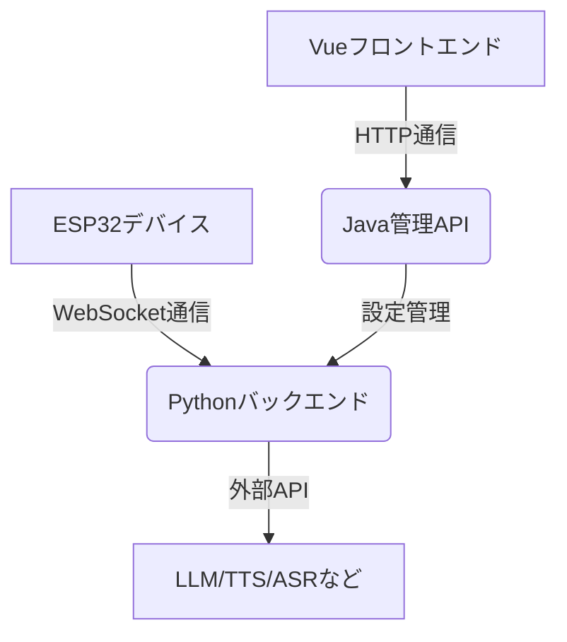
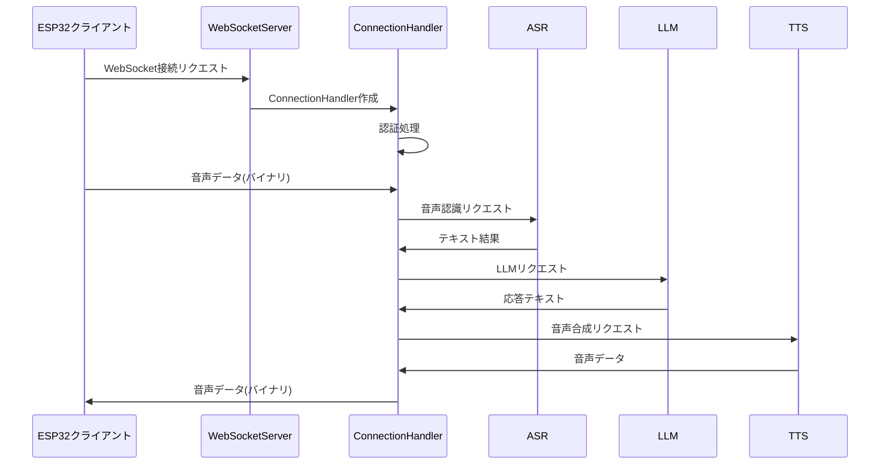

# XiaoZhi ESP32 Server 仕様書

## 1. 概要

### 1.1 プロジェクト説明

XiaoZhi ESP32 Server は、オープンソースのスマートハードウェアプロジェクト「xiaozhi-esp32」のバックエンドサービスを提供するプロジェクトです。Python、Java、Vue を使用して実装されており、ESP32 ハードウェアデバイスと連携して使用することを前提としています。

### 1.2 対象ユーザー

このプロジェクトは ESP32 ハードウェアデバイスと連携して使用する必要があり、ESP32 関連のハードウェアを既に購入し、Xia 哥がデプロイしたバックエンドサービスに正常に接続した経験があり、独自の`xiaozhi-esp32`バックエンドサービスを構築したいユーザーを対象としています。

### 1.3 主要機能

- **コアサービスアーキテクチャ**: WebSocket と HTTP サーバーに基づき、完全なコンソール管理と認証システムを提供
- **音声対話システム**: ストリーミング ASR(音声認識)、ストリーミング TTS(音声合成)、VAD(音声活動検出)をサポートし、多言語認識と音声処理をサポート
- **スマート対話システム**: 複数の LLM(大規模言語モデル)をサポートし、スマートな対話を実現
- **視覚認識システム**: 複数の VLLM(視覚大規模言語モデル)をサポートし、マルチモーダルな対話を実現
- **意図認識システム**: LLM 意図認識、Function Call 関数呼び出しをサポートし、プラグイン化された意図処理メカニズムを提供
- **記憶システム**: ローカル短期記憶、mem0ai インターフェース記憶をサポートし、記憶要約機能を備える
- **ツール呼び出し**: クライアント IOT プロトコル、クライアント MCP プロトコル、サーバー MCP プロトコル、MCP アクセスポイントプロトコル、カスタムツール関数をサポート
- **管理バックエンド**: Web 管理インターフェースを提供し、ユーザー管理、システム設定、デバイス管理をサポート
- **テストツール**: パフォーマンステストツール、視覚モデルテストツール、オーディオ対話テストツールを提供
- **デプロイサポート**: Docker デプロイとローカルデプロイをサポートし、完全な設定ファイル管理を提供
- **プラグインシステム**: 機能プラグインの拡張、カスタムプラグイン開発、プラグインのホットリロードをサポート

## 2. アーキテクチャ

### 2.1 全体構成

プロジェクトはマイクロサービスアーキテクチャを採用しており、以下の 3 つの主要コンポーネントで構成されています：

- **xiaozhi-server (Python)**: WebSocket と HTTP サーバーを提供し、音声対話、スマート対話、視覚認識などのコア機能を実装
- **manager-api (Java/SpringBoot)**: 管理 API を提供し、ユーザー管理、デバイス管理、システム設定などのバックエンド機能を実装
- **manager-web (Vue.js)**: Web 管理インターフェースを提供し、ユーザーがシステムを管理できるフロントエンドを実装

### 2.2 技術スタック

- **フロントエンド**: Vue.js
- **バックエンド**: Python (WebSocket/HTTP サーバー)、Java (SpringBoot)
- **データベース**: 未使用（設定ファイルまたはデータベースを使用）
- **外部サービス**:
  - **LLM**: Zhipu ChatGLM, Gemini, DoubaoLLM, Ollama, Dify, Fastgpt, Coze
  - **TTS**: EdgeTTS, Lingxi Streaming TTS, FishSpeech, GPT_SOVITS
  - **ASR**: FunASR, SherpaASR, DoubaoASR
  - **VAD**: SileroVAD
  - **Memory**: mem0ai, ローカル記憶

### 2.3 コンポーネント相互作用

## 3. コアモジュール設計

### 3.1 WebSocket サーバー (xiaozhi-server)

WebSocket サーバーは、ESP32 デバイスとのリアルタイム通信を処理するコアコンポーネントです。

#### 3.1.1 主要クラスと役割

- **WebSocketServer**: WebSocket サーバーのメインクラス。接続の確立、クライアントとの通信、コンポーネントの初期化を担当
- **ConnectionHandler**: クライアント接続ごとに作成されるハンドラ。音声処理、テキスト処理、メッセージルーティングなどを担当
- **AuthMiddleware**: 認証ミドルウェア。接続時の認証を処理

#### 3.1.2 データフロー

### 3.2 HTTP サーバー (xiaozhi-server)

HTTP サーバーは、OTA 更新や視覚認識などの機能を提供する補助コンポーネントです。

#### 3.2.1 主要クラスと役割

- **SimpleHttpServer**: HTTP サーバーのメインクラス。OTA ハンドラ、視覚認識ハンドラのルーティングを担当
- **OTAHandler**: OTA 更新リクエストを処理
- **VisionHandler**: 視覚認識リクエストを処理

### 3.3 管理 API (manager-api)

管理 API は、Web 管理インターフェースからのリクエストを処理し、システム設定やデバイス管理を提供します。

#### 3.3.1 主要機能

- ユーザー認証と管理
- デバイス管理
- システム設定管理
- プラグイン管理

### 3.4 管理 Web (manager-web)

管理 Web は、Vue.js で実装された Web 管理インターフェースです。

#### 3.4.1 主要機能

- ユーザーログイン/登録
- デバイス管理画面
- システム設定画面
- プラグイン管理画面

## 4. 認証とセキュリティ

### 4.1 認証方式

- WebSocket 接続時のヘッダー認証
- JWT トークンを使用した API 認証

### 4.2 セキュリティ考慮事項

- プロジェクトは未完成であり、ネットワークセキュリティ評価を通過していない
- 本番環境での使用は推奨されない
- 公開ネットワーク環境で使用する場合は、必要な保護措置を講じる必要がある

## 5. デプロイメント

### 5.1 デプロイ方法

プロジェクトは 2 つのデプロイ方法を提供しています：

#### 5.1.1 最小インストール

- 特徴: スマート対話、IoT、MCP、視覚認識
- 適用シーン: 低スペック環境、データは設定ファイルに保存、データベース不要
- 設定要件: `FunASR`を使用する場合は 2 コア 4G、すべて API の場合は 2 コア 2G が必要

#### 5.1.2 フルモジュールインストール

- 特徴: スマート対話、IoT、MCP アクセスポイント、視覚認識、OTA、スマートコントロールパネル
- 適用シーン: 完全な機能体験、データはデータベースに保存
- 設定要件: `FunASR`を使用する場合は 4 コア 8G、すべて API の場合は 2 コア 4G が必要

### 5.2 設定推奨

プロジェクトは 2 つの設定プランを提供しています：

1. `入門完全無料`設定：個人の家庭での使用に適しており、すべてのコンポーネントは無料プランを採用
2. `ストリーミング設定`：デモ、トレーニング、2 つ以上の同時接続などのシーンに適しており、ストリーミング処理技術を採用

## 6. テスト

### 6.1 テストツール

プロジェクトは以下のテストツールを提供しています：

- **オーディオ対話テストツール**: オーディオの再生と受信機能をテスト
- **モデル応答テストツール 1**: ASR、LLM、TTS の 3 つのコアモジュールの応答速度をテスト
- **モデル応答テストツール 2**: VLLM(視覚モデル)の応答速度をテスト

## 7. プラグインシステム

### 7.1 概要

プラグインシステムは、機能の拡張とカスタマイズを可能にする仕組みです。

### 7.2 主要機能

- 機能プラグインの拡張
- カスタムプラグイン開発
- プラグインのホットリロード

## 8. 制約と制限

### 8.1 技術制約

- コード規約: 未提供
- パフォーマンス要件:
  - 最小インストール: 2 コア CPU、2GB〜4GB RAM
  - フルインストール: 4 コア CPU、4GB〜8GB RAM

### 8.2 セキュリティ制約

- 本番環境での使用は非推奨
- 公開ネットワークでの使用時は適切な保護措置が必要

### 8.3 既知の問題とリスク

- ネットワークセキュリティ評価未通過
- サードパーティ API との連携におけるサービス品質の保証なし
- データベース未使用時のデータ永続性の制限
