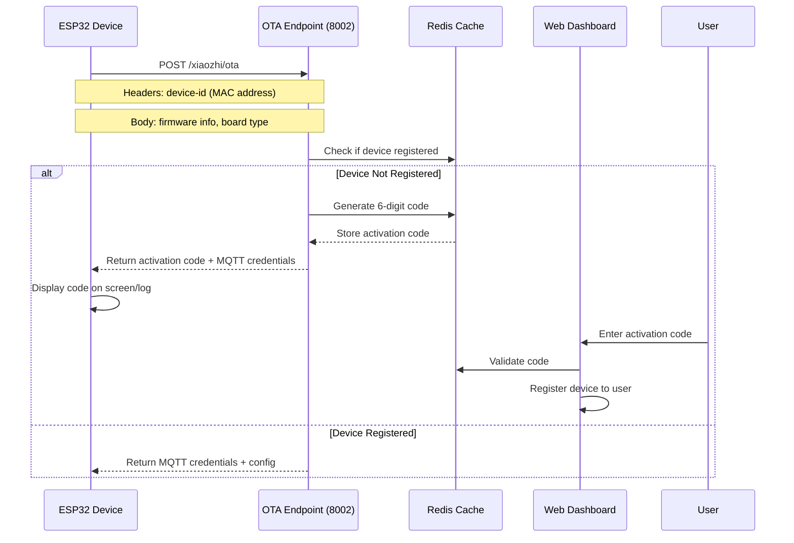
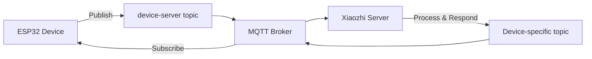
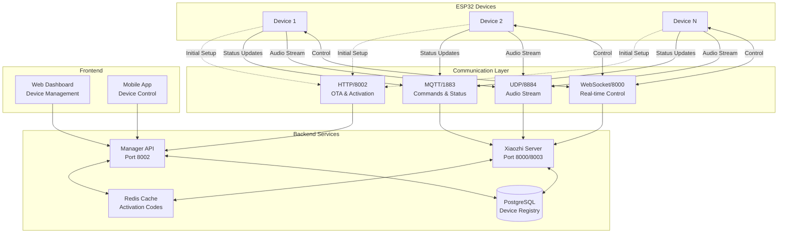

# Xiaozhi ESP32 Device Connectivity Guide

## Table of Contents
- [Overview](#overview)
- [Device Activation Process](#device-activation-process)
- [MQTT Communication](#mqtt-communication)
- [UDP Communication](#udp-communication)
- [WebSocket Communication](#websocket-communication)
- [Network Architecture](#network-architecture)
- [Troubleshooting](#troubleshooting)

## Overview

The Xiaozhi ESP32 Server supports multiple communication protocols for device connectivity:
- **HTTP/HTTPS**: For OTA updates and initial device registration
- **MQTT**: For real-time bidirectional communication
- **UDP**: For low-latency audio streaming
- **WebSocket**: For persistent real-time connections

## Device Activation Process

### 1. Initial Connection Flow



### 2. Activation Code Generation

**Location**: `DeviceServiceImpl.java:buildActivation()`

The activation process works as follows:

1. **Device Makes OTA Request**:
   ```http
   POST http://192.168.1.105:8002/xiaozhi/ota
   Headers:
     device-id: AA:BB:CC:DD:EE:FF
   Body:
     {
       "application": {"version": "1.0.0"},
       "board": {"type": "esp32s3"},
       "chip_model_name": "ESP32-S3"
     }
   ```

2. **Server Generates Activation Code**:
   ```java
   // 6-digit random code
   String newCode = RandomUtil.randomNumbers(6);
   
   // Store in Redis with two keys:
   // 1. Device data key
   String dataKey = "ota:device:" + deviceId;
   redisUtils.set(dataKey, deviceData);
   
   // 2. Code lookup key (for validation)
   String codeKey = "ota:activation:code:" + newCode;
   redisUtils.set(codeKey, deviceId);
   ```

3. **Response to Device**:
   ```json
   {
     "activation": {
       "code": "141966",
       "message": "http://dashboard.url\n141966",
       "challenge": "AA:BB:CC:DD:EE:FF"
     },
     "mqtt": {
       "endpoint": "192.168.1.105:1883",
       "client_id": "GID_test@@@AA_BB_CC_DD_EE_FF@@@uuid",
       "username": "base64_encoded_user_data",
       "password": "hmac_sha256_signature",
       "publish_topic": "device-server",
       "subscribe_topic": "null"
     }
   }
   ```

4. **User Activation**:
   - User sees code on device display/logs
   - Opens web dashboard
   - Enters 6-digit code
   - Device is bound to user account

## MQTT Communication

### MQTT Configuration

**Default Settings**:
- **Broker**: 192.168.1.105 (configurable)
- **Port**: 1883
- **Protocol**: MQTT 3.1.1

### MQTT Credential Generation

**Location**: `DeviceServiceImpl.java:buildMqttCredentials()`

The MQTT authentication uses a secure HMAC-SHA256 signature:

```java
// Client ID Format
String clientId = "GID_test@@@{mac_address}@@@{uuid}";
// Example: GID_test@@@AA_BB_CC_DD_EE_FF@@@550e8400-e29b-41d4-a716-446655440000

// Username (Base64 encoded JSON)
String userData = {"ip": "client_ip_address"};
String username = Base64.encode(userData);

// Password (HMAC-SHA256 signature)
String content = clientId + "|" + username;
String password = Base64.encode(
    HMAC_SHA256(content, signature_key)
);
```

### MQTT Topics

- **Device to Server**: `device-server`
- **Server to Device**: Device subscribes to personalized topics
- **Message Format**: JSON payloads

### MQTT Message Flow



## UDP Communication

### UDP Audio Streaming

**Configuration**:
- **Port**: 8884
- **Purpose**: Real-time audio streaming
- **Protocol**: Custom binary protocol

### UDP Packet Structure

```
+------------------+------------------+------------------+
|  Device ID (6B)  |  Sequence (4B)   |  Audio Data (nB) |
+------------------+------------------+------------------+
```

### Audio Parameters
```yaml
audio_params:
  format: opus          # Audio codec
  sample_rate: 16000    # Hz
  channels: 1           # Mono
  frame_duration: 60    # ms
```

### UDP Flow for Audio

1. **Device captures audio** from microphone
2. **Encodes with Opus** codec
3. **Sends UDP packets** to server:8884
4. **Server processes** audio (ASR/Speech recognition)
5. **Response sent** via MQTT or WebSocket

## WebSocket Communication

### WebSocket Endpoint

**URL Format**: `ws://{server_ip}:{port}/xiaozhi/v1/`

### Connection Flow

```javascript
// Client connection example
const ws = new WebSocket('ws://192.168.1.105:8000/xiaozhi/v1/');

ws.onopen = () => {
    // Send authentication
    ws.send(JSON.stringify({
        type: 'auth',
        device_id: 'AA:BB:CC:DD:EE:FF',
        token: 'device_token'
    }));
};

ws.onmessage = (event) => {
    const data = JSON.parse(event.data);
    // Handle server messages
};
```

## Network Architecture

### Complete System Architecture



### Port Summary

| Service | Port | Protocol | Purpose |
|---------|------|----------|---------|
| Manager API | 8002 | HTTP | Device OTA, Activation |
| Xiaozhi Server WS | 8000 | WebSocket | Real-time communication |
| Xiaozhi Server HTTP | 8003 | HTTP | API endpoints, MCP |
| MQTT Broker | 1883 | MQTT | Message broker |
| UDP Audio | 8884 | UDP | Audio streaming |
| Web Dashboard | 3000 | HTTP | User interface |

## Configuration Files

### 1. Server Configuration (`config.yaml`)

```yaml
server:
  ip: 0.0.0.0
  port: 8000           # WebSocket port
  http_port: 8003      # HTTP API port
  mqtt_gateway:
    enabled: true
    broker: 192.168.1.105
    port: 1883
    udp_port: 8884
```

### 2. Manager API Configuration

```yaml
manager-api:
  url: http://192.168.1.105:8002/xiaozhi
  secret: your-secret-key
```

## Troubleshooting

### Common Issues and Solutions

#### 1. Device Not Receiving Activation Code

**Symptom**: Device connects but no activation code generated

**Check**:
- Verify device is calling correct OTA endpoint (port 8002, not 8003)
- Check Redis is running and accessible
- Verify device-id header is present in request

**Solution**:
```bash
# Check Redis for activation codes
redis-cli
> KEYS ota:activation:code:*
> GET ota:device:AA:BB:CC:DD:EE:FF
```

#### 2. MQTT Connection Failed

**Symptom**: Device cannot connect to MQTT broker

**Check**:
- MQTT broker is running on port 1883
- Firewall allows MQTT traffic
- Credentials are correctly generated

**Debug**:
```bash
# Test MQTT connection
mosquitto_sub -h 192.168.1.105 -p 1883 -t "device-server" -v

# Check MQTT logs
tail -f /var/log/mosquitto/mosquitto.log
```

#### 3. UDP Audio Not Working

**Symptom**: Audio from device not received

**Check**:
- UDP port 8884 is open
- Audio format matches configuration (Opus, 16kHz, mono)
- Network allows UDP traffic

**Test**:
```python
# Simple UDP listener test
import socket
sock = socket.socket(socket.AF_INET, socket.SOCK_DGRAM)
sock.bind(('0.0.0.0', 8884))
while True:
    data, addr = sock.recvfrom(4096)
    print(f"Received {len(data)} bytes from {addr}")
```

#### 4. WebSocket Connection Drops

**Symptom**: WebSocket disconnects frequently

**Check**:
- Keepalive/ping-pong implemented
- Proxy/load balancer timeout settings
- Network stability

**Configuration**:
```javascript
// Client-side keepalive
setInterval(() => {
    if (ws.readyState === WebSocket.OPEN) {
        ws.send(JSON.stringify({type: 'ping'}));
    }
}, 30000); // Every 30 seconds
```

### Debug Logs

Enable debug logging for different components:

```yaml
log:
  log_level: DEBUG
  module_levels:
    OTA: DEBUG
    MQTT: DEBUG
    UDP: DEBUG
    WebSocket: DEBUG
```

### Testing Tools

1. **Test OTA Endpoint**:
```bash
curl -X POST http://192.168.1.105:8002/xiaozhi/ota \
  -H "device-id: AA:BB:CC:DD:EE:FF" \
  -H "Content-Type: application/json" \
  -d '{"application":{"version":"1.0.0"}}'
```

2. **Test MQTT Publish**:
```bash
mosquitto_pub -h 192.168.1.105 -p 1883 \
  -t "device-server" \
  -m '{"device_id":"AA:BB:CC:DD:EE:FF","message":"test"}'
```

3. **Monitor WebSocket**:
```javascript
// Browser console
const ws = new WebSocket('ws://192.168.1.105:8000/xiaozhi/v1/');
ws.onmessage = (e) => console.log('Received:', e.data);
ws.onerror = (e) => console.error('Error:', e);
```

## Security Considerations

1. **MQTT Authentication**: Uses HMAC-SHA256 signatures
2. **Activation Codes**: 6-digit codes with Redis TTL
3. **Device IDs**: MAC addresses as unique identifiers
4. **Network Security**: Consider using TLS/SSL for production
5. **API Keys**: Stored securely in environment variables

## Performance Optimization

1. **MQTT QoS**: Use QoS 0 for audio commands, QoS 1 for critical messages
2. **UDP Buffer**: Increase system UDP buffer for audio streaming
3. **WebSocket**: Implement connection pooling for multiple devices
4. **Redis**: Set appropriate TTL for activation codes (default: 5 minutes)

## Contact & Support

For issues or questions:
- GitHub Issues: [your-repo-url]
- Documentation: This guide
- Logs: Check `/tmp/xiaozhi-server.log` for detailed debugging