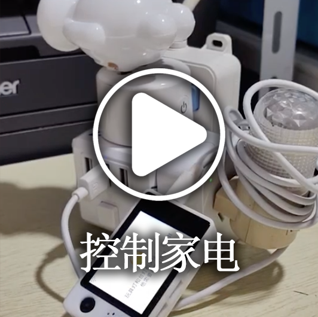
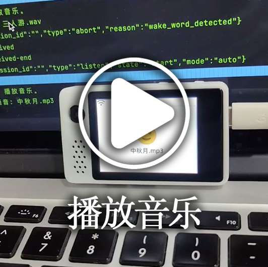

[](https://github.com/xinnan-tech/xiaozhi-esp32-server)

<h1 align="center">XiaoZhiバックエンドサービス xiaozhi-esp32-server</h1>

<p align="center">
このプロジェクトは、オープンソースのスマートハードウェアプロジェクト
<a href="https://github.com/78/xiaozhi-esp32">xiaozhi-esp32</a>にバックエンドサービスを提供します<br/>
<a href="https://ccnphfhqs21z.feishu.cn/wiki/M0XiwldO9iJwHikpXD5cEx71nKh">XiaoZhi通信プロトコル</a>に基づき、Python、Java、Vueを使用して実装されています<br/>
XiaoZhiサーバーを迅速に構築するのに役立ちます
</p>

<p align="center">
<a href="./README_en.md">English</a>
· <a href="./docs/FAQ.md">よくある質問</a>
· <a href="https://github.com/xinnan-tech/xiaozhi-esp32-server/issues">問題を報告</a>
· <a href="./README.md#%E9%83%A8%E7%BD%B2%E6%96%87%E6%A1%A3">デプロイドキュメント</a>
· <a href="https://github.com/xinnan-tech/xiaozhi-esp32-server/releases">更新履歴</a>
</p>
<p align="center">
  <a href="https://github.com/xinnan-tech/xiaozhi-esp32-server/releases">
    
  </a>
  <a href="https://github.com/xinnan-tech/xiaozhi-esp32-server/graphs/contributors">
    
  </a>
  <a href="https://github.com/xinnan-tech/xiaozhi-esp32-server/issues">
    
  </a>
  <a href="https://github.com/xinnan-tech/xiaozhi-esp32-server/pulls">
    
  </a>
  <a href="https://github.com/xinnan-tech/xiaozhi-esp32-server/blob/main/LICENSE">
    
  </a>
  <a href="https://github.com/xinnan-tech/xiaozhi-esp32-server">
    
  </a>
</p>

---

## 対象者 👥

このプロジェクトは ESP32 ハードウェアデバイスと連携して使用する必要があります。ESP32 関連のハードウェアを既に購入し、Xia 哥がデプロイしたバックエンドサービスに正常に接続した経験があり、独自の`xiaozhi-esp32`バックエンドサービスを構築したい場合は、このプロジェクトが最適です。

使用効果を見たいですか？ビデオをクリックしてください 🎥

<table>
  <tr>
    <td>
        <a href="https://www.bilibili.com/video/BV1FMFyejExX" target="_blank">
         <picture>
           
         </picture>
        </a>
    </td>
    <td>
        <a href="https://www.bilibili.com/video/BV1CDKWemEU6" target="_blank">
         <picture>
           
         </picture>
        </a>
    </td>
    <td>
        <a href="https://www.bilibili.com/video/BV12yA2egEaC" target="_blank">
         <picture>
           
         </picture>
        </a>
    </td>
    <td>
        <a href="https://www.bilibili.com/video/BV1pNXWYGEx1" target="_blank">
         <picture>
           
         </picture>
        </a>
    </td>
    <td>
        <a href="https://www.bilibili.com/video/BV1kgA2eYEQ9" target="_blank">
         <picture>
           
         </picture>
        </a>
    </td>
  </tr>
  <tr>
    <td>
        <a href="https://www.bilibili.com/video/BV1Vy96YCE3R" target="_blank">
         <picture>
           
         </picture>
        </a>
    </td>
    <td>
        <a href="https://www.bilibili.com/video/BV1VC96Y5EMH" target="_blank">
         <picture>
           
         </picture>
        </a>
    </td>
    <td>
        <a href="https://www.bilibili.com/video/BV1Z8XuYZEAS" target="_blank">
         <picture>
           
         </picture>
        </a>
    </td>
    <td>
        <a href="https://www.bilibili.com/video/BV178XuYfEpi" target="_blank">
         <picture>
           
         </picture>
        </a>
    </td>
    <td>
        <a href="https://www.bilibili.com/video/BV17LXWYvENb" target="_blank">
         <picture>
           
         </picture>
        </a>
    </td>
  </tr>
  <tr>
    <td>
      <a href="https://www.bilibili.com/video/BV12J7WzBEaH" target="_blank">
         <picture>
           
         </picture>
        </a>
    </td>
    <td>
      <a href="https://www.bilibili.com/video/BV1Co76z7EvK" target="_blank">
         <picture>
           
         </picture>
        </a>
    </td>
    <td>
      <a href="https://www.bilibili.com/video/BV1TJ7WzzEo6" target="_blank">
         <picture>
           
         </picture>
        </a>
    </td>
    <td>
          <a href="https://www.bilibili.com/video/BV1ZQKUzYExM" target="_blank">
         <picture>
           
         </picture>
        </a>
    </td>
    <td>
    </td>
  </tr>
</table>

---

## 警告 ⚠️

1. このプロジェクトはオープンソースソフトウェアです。このソフトウェアは、音声認識、大規模言語モデル、音声合成などのプラットフォームを含む、いかなるサードパーティ API サービスプロバイダーとも商業的な協力関係になく、そのサービス品質や資金の安全性についていかなる形の保証も提供しません。
   利用者は、関連するビジネスライセンスを保有するサービスプロバイダーを優先的に選択し、そのサービス契約とプライバシーポリシーを注意深く読むことをお勧めします。このソフトウェアは、アカウントのキーを保管せず、資金の移動に関与せず、チャージ資金の損失リスクを負いません。

2. このプロジェクトの機能は未完成であり、ネットワークセキュリティ評価を通過していません。本番環境では使用しないでください。公開ネットワーク環境でこのプロジェクトを学習・デプロイする場合は、必要な保護措置を必ず講じてください。

---

## デプロイドキュメント


このプロジェクトでは 2 つのデプロイ方法を提供しています。具体的なニーズに合わせて選択してください：

#### 🚀 デプロイ方法の選択

| デプロイ方法                   | 特徴                                                                               | 適用シーン                                                   | デプロイドキュメント                                                                                                                                                                                                                                                                                                                                                    | 設定要件                                                                 | ビデオチュートリアル                                                                        |
| ------------------------------ | ---------------------------------------------------------------------------------- | ------------------------------------------------------------ | ----------------------------------------------------------------------------------------------------------------------------------------------------------------------------------------------------------------------------------------------------------------------------------------------------------------------------------------------------------------------- | ------------------------------------------------------------------------ | ------------------------------------------------------------------------------------------- |
| **最小インストール**           | スマート対話、IoT、MCP、視覚認識                                                   | 低スペック環境、データは設定ファイルに保存、データベース不要 | [①Docker 版](./docs/Deployment.md#%E6%96%B9%E5%BC%8F%E4%B8%80docker%E5%8F%AA%E8%BF%90%E8%A1%8Cserver) / [② ソースコードデプロイ](./docs/Deployment.md#%E6%96%B9%E5%BC%8F%E4%BA%8C%E6%9C%AC%E5%9C%B0%E6%BA%90%E7%A0%81%E5%8F%AA%E8%BF%90%E8%A1%8Cserver)                                                                                                                 | `FunASR`を使用する場合は 2 コア 4G、すべて API の場合は 2 コア 2G が必要 | -                                                                                           |
| **フルモジュールインストール** | スマート対話、IoT、MCP アクセスポイント、視覚認識、OTA、スマートコントロールパネル | 完全な機能体験、データはデータベースに保存                   | [①Docker 版](./docs/Deployment_all.md#%E6%96%B9%E5%BC%8F%E4%B8%80docker%E8%BF%90%E8%A1%8C%E5%85%A8%E6%A8%A1%E5%9D%97) / [② ソースコードデプロイ](./docs/Deployment_all.md#%E6%96%B9%E5%BC%8F%E4%BA%8C%E6%9C%AC%E5%9C%B0%E6%BA%90%E7%A0%81%E8%BF%90%E8%A1%8C%E5%85%A8%E6%A8%A1%E5%9D%97) / [③ ソースコードデプロイ自動更新チュートリアル](./docs/dev-ops-integration.md) | `FunASR`を使用する場合は 4 コア 8G、すべて API の場合は 2 コア 4G が必要 | [ローカルソースコード起動ビデオチュートリアル](https://www.bilibili.com/video/BV1wBJhz4Ewe) |

> 💡 ヒント：以下は最新のコードでデプロイされたテストプラットフォームです。必要に応じて書き込んでテストできます。同時接続数は 6 で、データは毎日クリアされます。

```
スマートコントロールパネルアドレス: https://2662r3426b.vicp.fun

サービステストツール： https://2662r3426b.vicp.fun/test/
OTAインターフェースアドレス: https://2662r3426b.vicp.fun/xiaozhi/ota/
Websocketインターフェースアドレス: wss://2662r3426b.vicp.fun/xiaozhi/v1/
```

#### 🚩 設定の説明と推奨

> [!Note]
> このプロジェクトでは 2 つの設定プランを提供しています：
>
> 1. `入門完全無料`設定：個人の家庭での使用に適しており、すべてのコンポーネントは無料プランを採用しているため、追加料金は不要です。
>
> 2. `ストリーミング設定`：デモ、トレーニング、2 つ以上の同時接続などのシーンに適しており、ストリーミング処理技術を採用しているため、応答速度が速く、より良い体験が得られます。
>
> `0.5.2`バージョン以降、プロジェクトはストリーミング設定をサポートし、以前のバージョンと比較して応答速度が約`2.5秒`向上し、ユーザーエクスペリエンスが大幅に改善されました。

|        モジュール名        |           入門完全無料設定           |                      ストリーミング設定                      |
| :------------------------: | :----------------------------------: | :----------------------------------------------------------: |
|       ASR(音声認識)        |           FunASR(ローカル)           |           👍FunASRServer または 👍DoubaoStreamASR            |
|   LLM(大規模言語モデル)    |    ChatGLMLLM(Zhipu glm-4-flash)     |        👍DoubaoLLM(Volcano doubao-1-5-pro-32k-250115)        |
| VLLM(視覚大規模言語モデル) |   ChatGLMVLLM(Zhipu glm-4v-flash)    |          👍QwenVLVLLM(Qwen qwen2.5-vl-3b-instructh)          |
|       TTS(音声合成)        | ✅LinkeraiTTS(Lingxi ストリーミング) | 👍HuoshanDoubleStreamTTS(Volcano デュアルストリーム音声合成) |
|      Intent(意図認識)      |     function_call(関数呼び出し)      |                 function_call(関数呼び出し)                  |
|      Memory(記憶機能)      |  mem_local_short(ローカル短期記憶)   |              mem_local_short(ローカル短期記憶)               |

#### 🔧 テストツール

このプロジェクトでは、システムの検証と適切なモデルの選択に役立つ以下のテストツールを提供しています：

|          ツール名          | 場所                                             |                  使用方法                  |                                              機能説明                                              |
| :------------------------: | :----------------------------------------------- | :----------------------------------------: | :------------------------------------------------------------------------------------------------: |
| オーディオ対話テストツール | main》xiaozhi-server》test》test_page.html       |          Google Chrome で直接開く          |     オーディオの再生と受信機能をテストし、Python 側のオーディオ処理が正常かどうかを検証します      |
|  モデル応答テストツール 1  | main》xiaozhi-server》performance_tester.py      |   `python performance_tester.py` を実行    | ASR(音声認識)、LLM(大規模言語モデル)、TTS(音声合成)の 3 つのコアモジュールの応答速度をテストします |
|  モデル応答テストツール 2  | main》xiaozhi-server》performance_tester_vllm.py | `python performance_tester_vllm.py` を実行 |                              VLLM(視覚モデル)の応答速度をテストします                              |

> 💡 ヒント：モデルの速度をテストする際、キーが設定されているモデルのみがテストされます。

---

## 機能一覧 ✨

### 実装済み ✅

|       機能モジュール       | 説明                                                                                                                                            |
| :------------------------: | :---------------------------------------------------------------------------------------------------------------------------------------------- |
| コアサービスアーキテクチャ | WebSocket と HTTP サーバーに基づき、完全なコンソール管理と認証システムを提供                                                                    |
|      音声対話システム      | ストリーミング ASR(音声認識)、ストリーミング TTS(音声合成)、VAD(音声活動検出)をサポートし、多言語認識と音声処理をサポート                       |
|    スマート対話システム    | 複数の LLM(大規模言語モデル)をサポートし、スマートな対話を実現                                                                                  |
|      視覚認識システム      | 複数の VLLM(視覚大規模言語モデル)をサポートし、マルチモーダルな対話を実現                                                                       |
|      意図認識システム      | LLM 意図認識、Function Call 関数呼び出しをサポートし、プラグイン化された意図処理メカニズムを提供                                                |
|        記憶システム        | ローカル短期記憶、mem0ai インターフェース記憶をサポートし、記憶要約機能を備える                                                                 |
|       ツール呼び出し       | クライアント IOT プロトコル、クライアント MCP プロトコル、サーバー MCP プロトコル、MCP アクセスポイントプロトコル、カスタムツール関数をサポート |
|      管理バックエンド      | Web 管理インターフェースを提供し、ユーザー管理、システム設定、デバイス管理をサポート                                                            |
|        テストツール        | パフォーマンステストツール、視覚モデルテストツール、オーディオ対話テストツールを提供                                                            |
|      デプロイサポート      | Docker デプロイとローカルデプロイをサポートし、完全な設定ファイル管理を提供                                                                     |
|     プラグインシステム     | 機能プラグインの拡張、カスタムプラグイン開発、プラグインのホットリロードをサポート                                                              |

### 開発中 🚧

具体的な開発計画の進捗状況については、[こちらをクリック](https://github.com/users/xinnan-tech/projects/3)してください。

ソフトウェア開発者の方は、[『開発者への公開書簡』](docs/contributor_open_letter.md)をご覧ください。ご参加をお待ちしております！

---

## 製品エコシステム 👬

XiaoZhi はエコシステムです。この製品を使用する際には、このエコシステム内の他の優れたプロジェクトもご覧ください。

| プロジェクト名               | プロジェクトアドレス                                                                | プロジェクト説明                                                                                                                                                                                                                                   |
| :--------------------------- | :---------------------------------------------------------------------------------- | :------------------------------------------------------------------------------------------------------------------------------------------------------------------------------------------------------------------------------------------------- |
| XiaoZhi Android クライアント | [xiaozhi-android-client](https://github.com/TOM88812/xiaozhi-android-client)        | xiaozhi-server をベースにした Android、iOS 音声対話アプリケーションで、リアルタイムの音声対話とテキスト対話をサポートします。<br/>現在は flutter バージョンで、iOS、Android の両プラットフォームに対応しています。                                 |
| XiaoZhi PC クライアント      | [py-xiaozhi](https://github.com/Huang-junsen/py-xiaozhi)                            | このプロジェクトは、Python で実装された XiaoBai AI クライアントを提供し、物理的なハードウェアがない場合でも、<br/>コードを通じて XiaoZhi AI の機能を体験できます。                                                                                 |
| XiaoZhi Java サーバーサイド  | [xiaozhi-esp32-server-java](https://github.com/joey-zhou/xiaozhi-esp32-server-java) | XiaoZhi オープンソースバックエンドサービス Java バージョンは、Java ベースのオープンソースプロジェクトです。<br/>フロントエンドとバックエンドのサービスを含み、ユーザーに完全なバックエンドサービスソリューションを提供することを目的としています。 |

---

## このプロジェクトがサポートするプラットフォーム/コンポーネントのリスト 📋

### TTS 音声合成

|         使用方法         |                                                                                        サポートプラットフォーム                                                                                         |                   無料プラットフォーム                    |
| :----------------------: | :-----------------------------------------------------------------------------------------------------------------------------------------------------------------------------------------------------: | :-------------------------------------------------------: |
| インターフェース呼び出し | EdgeTTS, Volcano Engine Doubao TTS, Tencent Cloud, Alibaba Cloud TTS, CosyVoiceSiliconflow, TTS302AI, CozeCnTTS, GizwitsTTS, ACGNTTS, OpenAITTS, Lingxi Streaming TTS, Google TTS, Voicevox, ElevenLabs | Lingxi Streaming TTS, EdgeTTS, CosyVoiceSiliconflow(一部) |
|     ローカルサービス     |                                                                          FishSpeech, GPT_SOVITS_V2, GPT_SOVITS_V3, MinimaxTTS                                                                           |   FishSpeech, GPT_SOVITS_V2, GPT_SOVITS_V3, MinimaxTTS    |

---

### VAD 音声活動検出

| タイプ | プラットフォーム名 |   使用方法   | 課金モデル | 備考 |
| :----: | :----------------: | :----------: | :--------: | :--: |
|  VAD   |     SileroVAD      | ローカル使用 |    無料    |      |

---

### ASR 音声認識

|         使用方法         |            サポートプラットフォーム            |          無料プラットフォーム          |
| :----------------------: | :--------------------------------------------: | :------------------------------------: |
|       ローカル使用       |     FunASR, SherpaASR, Google ASR, Whisper     | FunASR, SherpaASR, Google ASR, Whisper |
| インターフェース呼び出し | DoubaoASR, FunASRServer, TencentASR, AliyunASR |              FunASRServer              |

---

### Memory 記憶ストレージ

| タイプ | プラットフォーム名 |         使用方法         |      課金モデル      | 備考 |
| :----: | :----------------: | :----------------------: | :------------------: | :--: |
| Memory |       mem0ai       | インターフェース呼び出し | 1000 回/月のクォータ |      |
| Memory |  mem_local_short   |       ローカル要約       |         無料         |      |

---

### Intent 意図認識

| タイプ | プラットフォーム名 |         使用方法         |   課金モデル   |                             備考                             |
| :----: | :----------------: | :----------------------: | :------------: | :----------------------------------------------------------: |
| Intent |     intent_llm     | インターフェース呼び出し | LLM による課金 |         大規模言語モデルによる意図認識、汎用性が高い         |
| Intent |   function_call    | インターフェース呼び出し | LLM による課金 | 大規模言語モデルの関数呼び出しによる意図の完成、高速で効果的 |

---

### LLM 言語モデル

|             使用方法             |                               サポートプラットフォーム                                |     無料プラットフォーム      |
| :------------------------------: | :-----------------------------------------------------------------------------------: | :---------------------------: |
| openai インターフェース呼び出し  | Alibaba Cloud Bailian, Volcano Engine Doubao, DeepSeek, Zhipu ChatGLM, Gemini, OpenAI | Zhipu ChatGLM, Gemini, OpenAI |
| ollama インターフェース呼び出し  |                                        Ollama                                         |               -               |
|  dify インターフェース呼び出し   |                                         Dify                                          |               -               |
| fastgpt インターフェース呼び出し |                                        Fastgpt                                        |               -               |
|  coze インターフェース呼び出し   |                                         Coze                                          |               -               |

実際には、openai インターフェース呼び出しをサポートするすべての LLM が接続して使用できます。

---

### VLLM 視覚モデル

|            使用方法             |         サポートプラットフォーム         | 無料プラットフォーム |
| :-----------------------------: | :--------------------------------------: | :------------------: |
| openai インターフェース呼び出し | Alibaba Cloud Bailian, Zhipu ChatGLMVLLM |  Zhipu ChatGLMVLLM   |

実際には、openai インターフェース呼び出しをサポートするすべての VLLM が接続して使用できます。

---

## 謝辞 🙏

|                          ロゴ                           |                        プロジェクト/会社                         | 説明                                                                                                                                                                                                                                                                                                                              |
| :-----------------------------------------------------: | :--------------------------------------------------------------: | :-------------------------------------------------------------------------------------------------------------------------------------------------------------------------------------------------------------------------------------------------------------------------------------------------------------------------------- |
|   | [Bailing 音声対話ロボット](https://github.com/wwbin2017/bailing) | このプロジェクトは[Bailing 音声対話ロボット](https://github.com/wwbin2017/bailing)に触発され、その基盤の上に実装されています                                                                                                                                                                                                      |
|  |              [Tenclass](https://www.tenclass.com/)               | [Tenclass](https://www.tenclass.com/)が XiaoZhi エコシステムのために標準的な通信プロトコル、マルチデバイス互換性ソリューション、および高並行性シナリオの実践的なデモンストレーションを策定してくれたことに感謝します。また、このプロジェクトに完全な技術文書サポートを提供してくれました                                          |
|  |        [Xuanfeng Technology](https://github.com/Eric0308)        | [Xuanfeng Technology](https://github.com/Eric0308)が関数呼び出しフレームワーク、MCP 通信プロトコル、およびプラグイン化された呼び出しメカニズムの実装コードを貢献してくれたことに感謝します。標準化された命令スケジューリングシステムと動的な拡張機能により、フロントエンドデバイス(IoT)の対話効率と機能拡張性が大幅に向上しました |
|   |             [Huiyuan Design](http://ui.kwd988.net/)              | [Huiyuan Design](http://ui.kwd988.net/)がこのプロジェクトに専門的なビジュアルソリューションを提供し、1000 社以上の企業にサービスを提供した設計経験を活かして、このプロジェクトの製品ユーザーエクスペリエンスを向上させてくれたことに感謝します                                                                                    |
|    |  [Xi'an Qinren Information Technology](https://www.029app.com/)  | [Xi'an Qinren Information Technology](https://www.029app.com/)がこのプロジェクトのビジュアルシステムを深化させ、マルチシナリオアプリケーションにおける全体的なデザインスタイルの一貫性と拡張性を確保してくれたことに感謝します                                                                                                    |

<a href="https://star-history.com/#xinnan-tech/xiaozhi-esp32-server&Date">

 <picture>
   <source media="(prefers-color-scheme: dark)" srcset="https://api.star-history.com/svg?repos=xinnan-tech/xiaozhi-esp32-server&type=Date&theme=dark" />
   <source media="(prefers-color-scheme: light)" srcset="https://api.star-history.com/svg?repos=xinnan-tech/xiaozhi-esp32-server&type=Date" />
   
 </picture>
</a>
