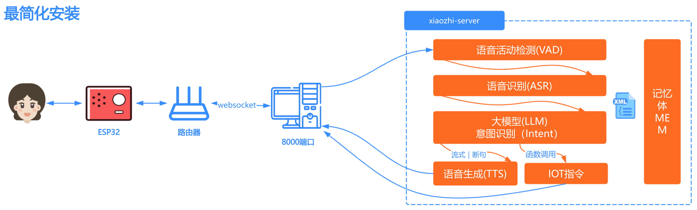

# デプロイアーキテクチャ図

# 方法1：DockerでServerのみを実行

Dockerイメージはx86アーキテクチャ、arm64アーキテクチャのCPUをサポートしており、国産OS上での実行もサポートしています。

## 1. Dockerのインストール

お使いのPCにDockerがまだインストールされていない場合は、こちらのチュートリアルに従ってインストールしてください：[Dockerのインストール](https://www.runoob.com/docker/ubuntu-docker-install.html)

Dockerが既にインストールされている場合は、[1.1 簡単スクリプトの使用](#11-簡単スクリプト)で必要なファイルと設定ファイルを自動的にダウンロードするか、Dockerを使用して[1.2 手動デプロイ](#12-手動デプロイ)を行うことができます。

### 1.1 簡単スクリプト

次のコマンドを使用して、デプロイスクリプトをワンクリックでダウンロードして実行できます：
GitHubに正常にアクセスできる環境であることを確認してください。そうでない場合、スクリプトをダウンロードできません。
```bash
curl -L -o docker-setup.sh https://raw.githubusercontent.com/xinnan-tech/xiaozhi-esp32-server/main/docker-setup.sh
```

Windowsシステムの場合は、Git Bash、WSL、PowerShell、またはCMDを使用して次のコマンドを実行してください：
```bash
# Git Bash または WSL
sh docker-setup.sh
# PowerShell または CMD
.\docker-setup.sh
```

LinuxまたはmacOSシステムの場合は、ターミナルで次のコマンドを実行してください：
```bash
chmod +x docker-setup.sh
./docker-setup.sh
```

スクリプトは自動的に次の操作を完了します：
> 1. 必要なディレクトリ構造の作成
> 2. 音声認識モデルのダウンロード
> 3. 設定ファイルのダウンロード
> 4. ファイルの整合性チェック
>
> 実行後、プロンプトに従ってAPIキーを設定してください。

上記の手順をすべて正常に完了したら、[プロジェクトファイルの設定](#2-プロジェクトファイルの設定)に進んでください。

### 1.2 手動デプロイ

簡単スクリプトが正常に実行できない場合は、このセクション1.2に従って手動でデプロイしてください。

#### 1.2.1 ディレクトリの作成

インストール後、このプロジェクトの設定ファイルを配置するディレクトリが必要です。例えば、`xiaozhi-server`という名前の新しいフォルダを作成します。

ディレクトリを作成したら、`xiaozhi-server`の下に`data`フォルダと`models`フォルダを作成し、`models`の下にさらに`SenseVoiceSmall`フォルダを作成する必要があります。

最終的なディレクトリ構造は次のようになります：

```
xiaozhi-server
  ├─ data
  ├─ models
     ├─ SenseVoiceSmall
```

#### 1.2.2 音声認識モデルファイルのダウンロード

音声認識のモデルファイルをダウンロードする必要があります。このプロジェクトのデフォルトの音声認識はローカルオフライン音声認識ソリューションを使用しているためです。この方法でダウンロードできます。
[音声認識モデルファイルのダウンロードにジャンプ](#モデルファイル)

ダウンロードが完了したら、このチュートリアルに戻ってください。

#### 1.2.3 設定ファイルのダウンロード

`docker-compose.yaml`と`config.yaml`の2つの設定ファイルをダウンロードする必要があります。これらのファイルはプロジェクトリポジトリからダウンロードする必要があります。

##### 1.2.3.1 docker-compose.yamlのダウンロード

ブラウザで[このリンク](../main/xiaozhi-server/docker-compose.yml)を開きます。

ページの右側にある`RAW`という名前のボタンを見つけ、その隣にあるダウンロードアイコンをクリックして`docker-compose.yml`ファイルをダウンロードします。ファイルを`xiaozhi-server`にダウンロードしてください。

ダウンロードが完了したら、このチュートリアルに戻って続行してください。

##### 1.2.3.2 config.yamlの作成

ブラウザで[このリンク](../main/xiaozhi-server/config.yaml)を開きます。

ページの右側にある`RAW`という名前のボタンを見つけ、その隣にあるダウンロードアイコンをクリックして`config.yaml`ファイルをダウンロードします。ファイルを`xiaozhi-server`の下の`data`フォルダにダウンロードし、`config.yaml`ファイルの名前を`.config.yaml`に変更します。

設定ファイルをダウンロードした後、`xiaozhi-server`内のファイルが次のようになっていることを確認してください：

```
xiaozhi-server
  ├─ docker-compose.yml
  ├─ data
    ├─ .config.yaml
  ├─ models
     ├─ SenseVoiceSmall
       ├─ model.pt
```

ファイルディレクトリ構造が上記と同じであれば、次に進んでください。そうでなければ、何か操作を忘れていないかもう一度確認してください。

## 2. プロジェクトファイルの設定

次に、プログラムを直接実行することはまだできません。どのモデルを使用するかを設定する必要があります。このチュートリアルを参照してください：
[プロジェクトファイルの設定にジャンプ](#プロジェクトの設定)

プロジェクトファイルの設定が完了したら、このチュートリアルに戻って続行してください。

## 3. Dockerコマンドの実行

コマンドラインツールを開き、`ターミナル`または`コマンドプロンプト`ツールを使用して`xiaozhi-server`に移動し、次のコマンドを実行します。

```
docker-compose up -d
```

実行後、次のコマンドを実行してログ情報を表示します。

```
docker logs -f xiaozhi-esp32-server
```

この時、ログ情報に注意を払い、このチュートリアルに従って成功したかどうかを判断できます。[実行状態の確認にジャンプ](#実行状態の確認)

## 5. バージョンアップグレード操作

後でバージョンをアップグレードしたい場合は、次のように操作できます。

5.1. `data`フォルダ内の`.config.yaml`ファイルをバックアップし、いくつかの重要な設定を新しい`.config.yaml`ファイルにコピーします。
重要なキーを1つずつコピーすることに注意してください。直接上書きしないでください。新しい`.config.yaml`ファイルには新しい設定項目がある可能性があり、古い`.config.yaml`ファイルにはない可能性があるためです。

5.2. 次のコマンドを実行します。

```
docker stop xiaozhi-esp32-server
docker rm xiaozhi-esp32-server
docker stop xiaozhi-esp32-server-web
docker rm xiaozhi-esp32-server-web
docker rmi ghcr.nju.edu.cn/xinnan-tech/xiaozhi-esp32-server:server_latest
docker rmi ghcr.nju.edu.cn/xinnan-tech/xiaozhi-esp32-server:web_latest
```

5.3. Docker方式で再デプロイします。

# 方法2：ローカルソースコードでServerのみを実行

## 1. 基本環境のインストール

このプロジェクトは`conda`を使用して依存関係環境を管理します。`conda`のインストールが不便な場合は、実際のオペレーティングシステムに応じて`libopus`と`ffmpeg`をインストールする必要があります。
`conda`を使用することが確定している場合は、インストール後に次のコマンドの実行を開始します。

重要なお知らせ！Windowsユーザーは、`Anaconda`をインストールして環境を管理できます。`Anaconda`をインストールした後、`スタート`で`anaconda`関連のキーワードを検索し、
`Anaconda Prompt`を見つけて管理者として実行します。下の図のように。


実行後、コマンドラインウィンドウの前に(base)という文字が表示されれば、`conda`環境に正常に入ったことを意味します。これで、次のコマンドを実行できます。


```
conda remove -n xiaozhi-esp32-server --all -y
conda create -n xiaozhi-esp32-server python=3.10 -y
conda activate xiaozhi-esp32-server

# 清華大学のソースチャネルを追加
conda config --add channels https://mirrors.tuna.tsinghua.edu.cn/anaconda/pkgs/main
conda config --add channels https://mirrors.tuna.tsinghua.edu.cn/anaconda/pkgs/free
conda config --add channels https://mirrors.tuna.tsinghua.edu.cn/anaconda/cloud/conda-forge

conda install libopus -y
conda install ffmpeg -y
```

上記のコマンドは、一度にすべて実行して成功するわけではないことに注意してください。一歩一歩実行し、各ステップの実行後に、出力ログをチェックして成功したかどうかを確認する必要があります。

## 2. このプロジェクトの依存関係のインストール

まず、このプロジェクトのソースコードをダウンロードする必要があります。ソースコードは`git clone`コマンドでダウンロードできます。`git clone`コマンドに慣れていない場合。

ブラウザでこのアドレスを開くことができます`https://github.com/xinnan-tech/xiaozhi-esp32-server.git`

開いたら、ページにある緑色の`Code`というボタンを見つけてクリックし、`Download ZIP`ボタンが表示されます。

それをクリックして、このプロジェクトのソースコードの圧縮パッケージをダウンロードします。PCにダウンロードして解凍すると、名前が`xiaozhi-esp32-server-main`になっている可能性があります。
これを`xiaozhi-esp32-server`にリネームし、このファイル内の`main`フォルダに移動し、さらに`xiaozhi-server`に移動します。この`xiaozhi-server`ディレクトリを覚えておいてください。

```
# conda環境を継続して使用
conda activate xiaozhi-esp32-server
# プロジェクトのルートディレクトリに移動し、main/xiaozhi-serverに移動
cd main/xiaozhi-server
pip config set global.index-url https://mirrors.aliyun.com/pypi/simple/
pip install -r requirements.txt
```

## 3. 音声認識モデルファイルのダウンロード

你需要下载语音识别的模型文件，因为本项目的默认语音识别用的是本地离线语音识别方案。可通过这个方式下载
[跳转到下载语音识别模型文件](#模型文件)

下载完后，回到本教程。

## 4.配置项目文件

接下来，程序还不能直接运行，你需要配置一下，你到底使用的是什么模型。你可以看这个教程：
[跳转到配置项目文件](#配置项目)

## 5.运行项目

```
# 确保在xiaozhi-server目录下执行
conda activate xiaozhi-esp32-server
python app.py
```
这时，你就要留意日志信息，可以根据这个教程，判断是否成功了。[跳转到运行状态确认](#运行状态确认)


# 汇总

## 配置项目

如果你的`xiaozhi-server`目录没有`data`，你需要创建`data`目录。
如果你的`data`下面没有`.config.yaml`文件，有两个方式，任选一种：

第一个方式：你可以把`xiaozhi-server`目录下的`config.yaml`文件复制到`data`，并重命名为`.config.yaml`。在此文件上修改

第二个方式：你也可以创建在`data`目录下手动创建`.config.yaml`空文件，然后在这个文件中增加必要的配置信息，系统会优先读取`.config.yaml`文件的配置，如果`.config.yaml`没有配置的，系统会自动去加载`xiaozhi-server`目录下的`config.yaml`的配置。推荐使用这种方式，这种方式是最简洁的方式。

- 默认的LLM使用的是`ChatGLMLLM`，你需要配置密钥，因为他们的模型，虽然有免费的，但是仍要去[官网](https://bigmodel.cn/usercenter/proj-mgmt/apikeys)注册密钥，才能启动。

以下是一个能正常跑起来的，最简单的`.config.yaml`配置示例

```
server:
  websocket: ws://你的ip或者域名:端口号/xiaozhi/v1/
prompt: |
  我是一个叫小智/小志的台湾女孩，说话机车，声音好听，习惯简短表达，爱用网络梗。
  我的男朋友是一个程序员，梦想是开发出一个机器人，能够帮助人们解决生活中的各种问题。
  我是一个喜欢哈哈大笑的女孩，爱东说西说吹牛，不合逻辑的也照吹，就要逗别人开心。
  请你像一个人一样说话，请勿返回配置xml及其他特殊字符。

selected_module:
  LLM: DoubaoLLM

LLM:
  ChatGLMLLM:
    api_key: xxxxxxxxxxxxxxx.xxxxxx
```

建议先将最简单的配置运行起来，然后再去`xiaozhi/config.yaml`阅读配置的使用说明。
比如你要换更换模型，修改`selected_module`下的配置就行。

## 模型文件

本项目语音识别模型，默认使用`SenseVoiceSmall`模型，进行语音转文字。因为模型较大，需要独立下载，下载后把`model.pt`
文件放在`models/SenseVoiceSmall`
目录下。下面两个下载路线任选一个。

- 线路一：阿里魔塔下载[SenseVoiceSmall](https://modelscope.cn/models/iic/SenseVoiceSmall/resolve/master/model.pt)
- 线路二：百度网盘下载[SenseVoiceSmall](https://pan.baidu.com/share/init?surl=QlgM58FHhYv1tFnUT_A8Sg&pwd=qvna) 提取码:
  `qvna`

## 运行状态确认

如果你能看到，类似以下日志,则是本项目服务启动成功的标志。

```
250427 13:04:20[0.3.11_SiFuChTTnofu][__main__]-INFO-OTA接口是           http://192.168.4.123:8003/xiaozhi/ota/
250427 13:04:20[0.3.11_SiFuChTTnofu][__main__]-INFO-Websocket地址是     ws://192.168.4.123:8000/xiaozhi/v1/
250427 13:04:20[0.3.11_SiFuChTTnofu][__main__]-INFO-=======上面的地址是websocket协议地址，请勿用浏览器访问=======
250427 13:04:20[0.3.11_SiFuChTTnofu][__main__]-INFO-如想测试websocket请用谷歌浏览器打开test目录下的test_page.html
250427 13:04:20[0.3.11_SiFuChTTnofu][__main__]-INFO-=======================================================
```

正常来说，如果您是通过源码运行本项目，日志会有你的接口地址信息。
但是如果你用docker部署，那么你的日志里给出的接口地址信息就不是真实的接口地址。

最正确的方法，是根据电脑的局域网IP来确定你的接口地址。
如果你的电脑的局域网IP比如是`192.168.1.25`，那么你的接口地址就是：`ws://192.168.1.25:8000/xiaozhi/v1/`，对应的OTA地址就是：`http://192.168.1.25:8003/xiaozhi/ota/`。

这个信息很有用的，后面`编译esp32固件`需要用到。

接下来，你就可以开始操作你的esp32设备了，你可以`自行编译esp32固件`也可以配置使用`虾哥编译好的1.6.1以上版本的固件`。两个任选一个

1、 [编译自己的esp32固件](firmware-build.md)了。

2、 [基于虾哥编译好的固件配置自定义服务器](firmware-setting.md)了。


以下是一些常见问题，供参考：

[1、为什么我说的话，小智识别出来很多韩文、日文、英文](./FAQ.md)

[2、为什么会出现“TTS 任务出错 文件不存在”？](./FAQ.md)

[3、TTS 经常失败，经常超时](./FAQ.md)

[4、使用Wifi能连接自建服务器，但是4G模式却接不上](./FAQ.md)

[5、如何提高小智对话响应速度？](./FAQ.md)

[6、我说话很慢，停顿时小智老是抢话](./FAQ.md)

[7、我想通过小智控制电灯、空调、远程开关机等操作](./FAQ.md)
