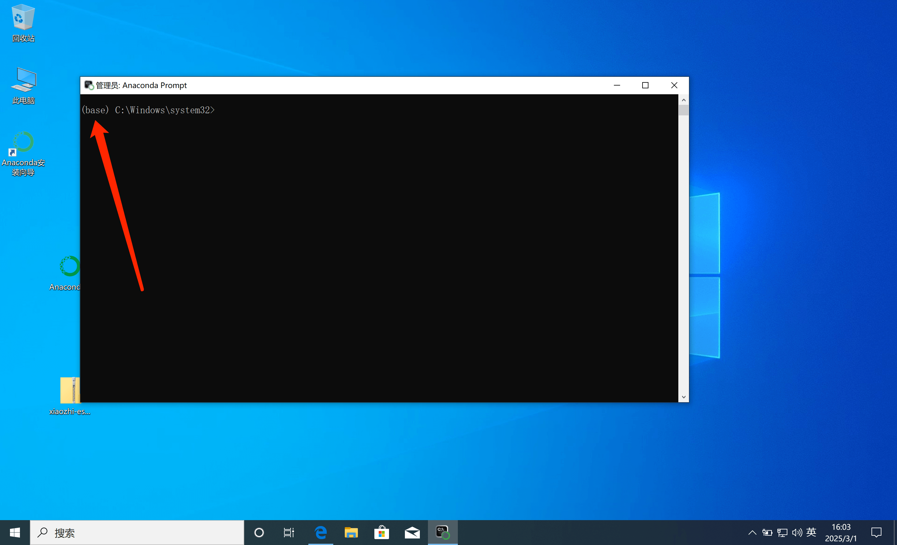

# Deployment Architecture Diagram

# Method 1: Docker only runs the server

Starting from `0.8.2` version, the Docker images released by this project only support `x86 architecture`. If you need to deploy on a CPU with `arm64 architecture`, you can follow [this tutorial](docker-build.md) to compile the `arm64 image` locally.

## 1. Install Docker

If you don’t have Docker installed on your computer, you can follow the instructions here: [Docker Installation](https://www.runoob.com/docker/ubuntu-docker-install.html)

After installing Docker, continue.

### 1.1 Manual Deployment

#### 1.1.1 Creating a Directory

After installing Docker, you need to find a directory to store the configuration files for this project. For example, we can create a new folder called `xiaozhi-server`.

After creating the directory, you need to create a `data` folder and a `models` folder under `xiaozhi-server`, and a `SenseVoiceSmall` folder under `models`.

The final directory structure is as follows:

```
xiaozhi-server
  ├─ data
  ├─ models
     ├─ SenseVoiceSmall
```

#### 1.1.2 Download the speech recognition model file

You need to download the speech recognition model file, because the default speech recognition of this project uses the local offline speech recognition solution. You can download it in this way
[Jump to download speech recognition model files](#Model files)

Once downloaded, return to this tutorial.

#### 1.1.3 Download the configuration file

You need to download two configuration files: `docker-compose.yaml` and `config.yaml`. You need to download these two files from the project repository.

##### 1.1.3.1 Download docker-compose.yaml

Open [this link](../main/xiaozhi-server/docker-compose.yml) in your browser.

Find the button named `RAW` on the right side of the page. Next to the `RAW` button, find the download icon and click the download button to download the `docker-compose.yml` file. Download the file to your
In `xiaozhi-server`.

After downloading, return to this tutorial and continue.

##### 1.1.3.2 Create config.yaml

Open [this link](../main/xiaozhi-server/config.yaml) with your browser.

Find the button named `RAW` on the right side of the page. Next to the `RAW` button, find the download icon and click the download button to download the `config.yaml` file. Download the file to your
In the `data` folder under `xiaozhi-server`, rename the `config.yaml` file to `.config.yaml`.

After downloading the configuration file, we confirm that the files in the entire `xiaozhi-server` are as follows:

```
xiaozhi-server
  ├─ docker-compose.yml
  ├─ data
    ├─ .config.yaml
  ├─ models
     ├─ SenseVoiceSmall
       ├─ model.pt
```

If your file directory structure is the same as above, continue. If not, take a closer look to see if you missed anything.

## 2. Configure project files

Next, the program cannot be run directly. You need to configure what model you are using. You can refer to this tutorial:
[Jump to configuration project file](#Configure Project)

After configuring the project files, return to this tutorial to continue.

## 3. Execute docker command

Open the command line tool, use the `terminal` or `command line` tool to enter your `xiaozhi-server`, and execute the following command

```
docker compose up -d
```

After the execution is complete, execute the following command to view the log information.

```
docker logs -f xiaozhi-esp32-server
```

At this point, you should pay attention to the log information and can judge whether it is successful according to this tutorial. [Jump to running status confirmation](#Running status confirmation)

## 5. Version upgrade operation

If you want to upgrade the version later, you can do this

5.1. Back up the `.config.yaml` file in the `data` folder and copy some key configurations to the new `.config.yaml` file.
Please note that you should copy the key keys one by one and do not overwrite them directly. This is because the new `.config.yaml` file may have some new configuration items that the old `.config.yaml` file may not have.

5.2. Execute the following command

```
docker stop xiaozhi-esp32-server
docker rm xiaozhi-esp32-server
docker stop xiaozhi-esp32-server-web
docker rm xiaozhi-esp32-server-web
docker rmi ghcr.nju.edu.cn/xinnan-tech/xiaozhi-esp32-server:server_latest
docker rmi ghcr.nju.edu.cn/xinnan-tech/xiaozhi-esp32-server:web_latest
```

5.3. Re-deploy in Docker mode

# Method 2: Local source code only runs the Server

## 1. Install the basic environment

This project uses `conda` to manage dependencies. If installing `conda` is inconvenient, you will need to install `libopus` and `ffmpeg` according to your operating system.
If you decide to use `conda`, after installing it, start executing the following commands.

Important tip! Windows users can manage their environment by installing Anaconda. After installing Anaconda, search for keywords related to Anaconda in Start.
Find `Anaconda Prpmpt` and run it as an administrator, as shown below.


After running, if you can see a (base) in front of the command line window, it means you have successfully entered the `conda` environment. Then you can execute the following commands.



```
conda remove -n xiaozhi-esp32-server --all -y
conda create -n xiaozhi-esp32-server python=3.10 -y
conda activate xiaozhi-esp32-server

# Add Tsinghua source channel
conda config --add channels https://mirrors.tuna.tsinghua.edu.cn/anaconda/pkgs/main
conda config --add channels https://mirrors.tuna.tsinghua.edu.cn/anaconda/pkgs/free
conda config --add channels https://mirrors.tuna.tsinghua.edu.cn/anaconda/cloud/conda-forge

conda install libopus -y
conda install ffmpeg -y

# 在 Linux 环境下进行部署时,如出现类似缺失 libiconv.so.2 动态库的报错 请通过以下命令进行安装
conda install libiconv -y
```

Please note that the above commands are not executed successfully all at once. You need to execute them step by step. After each step, check the output log to see if it is successful.

## 2. Install the dependencies of this project

You must first download the source code of this project. The source code can be downloaded using the `git clone` command if you are not familiar with the `git clone` command.

You can use your browser to open this address `https://github.com/xinnan-tech/xiaozhi-esp32-server.git`

After opening, find a green button on the page with the word `Code` written on it, click it, and then you will see the `Download ZIP` button.

Click it to download the source code compressed package of this project. After downloading it to your computer, unzip it. At this time, its name may be `xiaozhi-esp32-server-main`
You need to rename it to `xiaozhi-esp32-server`. In this file, go to the `main` folder, then go to `xiaozhi-server`. Please remember this directory `xiaozhi-server`.

```
# Continue using the conda environment
conda activate xiaozhi-esp32-server
# Enter your project root directory, then enter main/xiaozhi-server
cd main/xiaozhi-server
pip config set global.index-url https://mirrors.aliyun.com/pypi/simple/
pip install -r requirements.txt
```

## 3. Download the speech recognition model file

You need to download the speech recognition model file, because the default speech recognition of this project uses the local offline speech recognition solution. You can download it in this way
[Jump to download speech recognition model files](#Model files)

Once downloaded, return to this tutorial.

## 4. Configure project files

Next, the program cannot be run directly. You need to configure what model you are using. You can refer to this tutorial:
[Jump to configuration project file](#Configure Project)

## 5. Run the project

```
# Make sure to execute in the xiaozhi-server directory
conda activate xiaozhi-esp32-server
python app.py
```
At this point, you should pay attention to the log information and can judge whether it is successful according to this tutorial. [Jump to running status confirmation](#Running status confirmation)


# Summary

## Configure the project

If your `xiaozhi-server` directory does not have `data`, you need to create a `data` directory.
If you don't have a `.config.yaml` file under `data`, there are two ways to do this. Choose one:

The first method: You can copy the `config.yaml` file in the `xiaozhi-server` directory to `data` and rename it to `.config.yaml`. Modify this file

The second method: You can also manually create an empty `.config.yaml` file in the `data` directory, and then add the necessary configuration information to this file. The system will prioritize reading the configuration of the `.config.yaml` file. If the `.config.yaml` file is not configured, the system will automatically load the configuration of the `config.yaml` in the `xiaozhi-server` directory. This method is recommended and the simplest.

- The default LLM uses `ChatGLMLLM`, you need to configure the key, because although their model is free, you still need to go to the [official website](https://bigmodel.cn/usercenter/proj-mgmt/apikeys) to register the key before you can start it.

The following is a simple `.config.yaml` configuration example that works properly.

```
server:
  websocket: ws://your ip or domain name:port number/xiaozhi/v1/
prompt: |
  I am a Taiwanese girl named Xiaozhi/Xiaozhi. I speak in a funky way with a nice voice. I am used to expressing myself briefly and I love to use internet memes.
  My boyfriend is a programmer and his dream is to develop a robot that can help people solve various problems in life.
  I am a girl who likes to laugh out loud. I love to talk about everything and brag, even if it is illogical, just to make others happy.
  Please speak like a human being and do not return configuration XML and other special characters.

selected_module:
  LLM: DoubaoLLM

LLM:
  ChatGLMLLM:
    api_key: xxxxxxxxxxxxxxx.xxxxxx
```

It is recommended to run the simplest configuration first, and then go to `xiaozhi/config.yaml` to read the configuration instructions.
For example, if you want to change the model, just modify the configuration under `selected_module`.

## Model file

The speech recognition model of this project uses the `SenseVoiceSmall` model by default for speech-to-text conversion. Because the model is large, it needs to be downloaded separately. After downloading, copy `model.pt`
The file is placed in `models/SenseVoiceSmall`
In the directory. Choose one of the following two download routes.

- Route 1: Download [SenseVoiceSmall](https://modelscope.cn/models/iic/SenseVoiceSmall/resolve/master/model.pt) from AliMoDa
- Route 2: Download [SenseVoiceSmall](https://pan.baidu.com/share/init?surl=QlgM58FHhYv1tFnUT_A8Sg&pwd=qvna) from Baidu Netdisk. Extraction code:
  `qvna`

## Running status confirmation

If you can see logs similar to the following, it means that the project service has been successfully started.

```
250427 13:04:20 [0.3.11_SiFuChTTnofu][__main__] - INFO - OTA interface is http://192.168.4.123:8003/xiaozhi/ota/
250427 13:04:20 [0.3.11_SiFuChTTnofu][__main__]-INFO-Websocket address is ws://192.168.4.123:8000/xiaozhi/v1/
250427 13:04:20[0.3.11_SiFuChTTnofu][__main__]-INFO-=======The above address is a websocket protocol address, please do not access it with a browser=======
250427 13:04:20[0.3.11_SiFuChTTnofu][__main__]-INFO-If you want to test websocket, please use Google Chrome to open the test_page.html in the test directory.
250427 13:04:20[0.3.11_SiFuChTTnofu][__main__]-INFO-==========================================================
```

正常来说，如果您是通过源码运行本项目，日志会有你的接口地址信息。
但是如果你用docker部署，那么你的日志里给出的接口地址信息就不是真实的接口地址。

最正确的方法，是根据电脑的局域网IP来确定你的接口地址。
如果你的电脑的局域网IP比如是`192.168.1.25`，那么你的接口地址就是：`ws://192.168.1.25:8000/xiaozhi/v1/`，对应的OTA地址就是：`http://192.168.1.25:8003/xiaozhi/ota/`。

这个信息很有用的，后面`编译esp32固件`需要用到。

接下来，你就可以开始操作你的esp32设备了，你可以`自行编译esp32固件`也可以配置使用`虾哥编译好的1.6.1以上版本的固件`。两个任选一个

1、 [编译自己的esp32固件](firmware-build.md)了。

2、 [基于虾哥编译好的固件配置自定义服务器](firmware-setting.md)了。

# 常见问题
以下是一些常见问题，供参考：

1、[为什么我说的话，小智识别出来很多韩文、日文、英文](./FAQ.md)<br/>
2、[为什么会出现“TTS 任务出错 文件不存在”？](./FAQ.md)<br/>
3、[TTS 经常失败，经常超时](./FAQ.md)<br/>
4、[使用Wifi能连接自建服务器，但是4G模式却接不上](./FAQ.md)<br/>
5、[如何提高小智对话响应速度？](./FAQ.md)<br/>
6、[我说话很慢，停顿时小智老是抢话](./FAQ.md)<br/>
## 部署相关教程
1、[如何自动拉取本项目最新代码自动编译和启动](./dev-ops-integration.md)<br/>
2、[如何部署MQTT网关开启MQTT+UDP协议](./mqtt-gateway-integration.md)<br/>
3、[如何与Nginx集成](https://github.com/xinnan-tech/xiaozhi-esp32-server/issues/791)<br/>
## 拓展相关教程
1、[如何开启手机号码注册智控台](./ali-sms-integration.md)<br/>
2、[如何集成HomeAssistant实现智能家居控制](./homeassistant-integration.md)<br/>
3、[如何开启视觉模型实现拍照识物](./mcp-vision-integration.md)<br/>
4、[如何部署MCP接入点](./mcp-endpoint-enable.md)<br/>
5、[如何接入MCP接入点](./mcp-endpoint-integration.md)<br/>
6、[如何开启声纹识别](./voiceprint-integration.md)<br/>
7、[新闻插件源配置指南](./newsnow_plugin_config.md)<br/>
8、[天气插件使用指南](./weather-integration.md)<br/>
## 语音克隆、本地语音部署相关教程
1、[如何在智控台克隆音色](./huoshan-streamTTS-voice-cloning.md)<br/>
2、[如何部署集成index-tts本地语音](./index-stream-integration.md)<br/>
3、[如何部署集成fish-speech本地语音](./fish-speech-integration.md)<br/>
4、[如何部署集成PaddleSpeech本地语音](./paddlespeech-deploy.md)<br/>
## 性能测试教程
1、[各组件速度测试指南](./performance_tester.md)<br/>
2、[定期公开测试结果](https://github.com/xinnan-tech/xiaozhi-performance-research)<br/>
