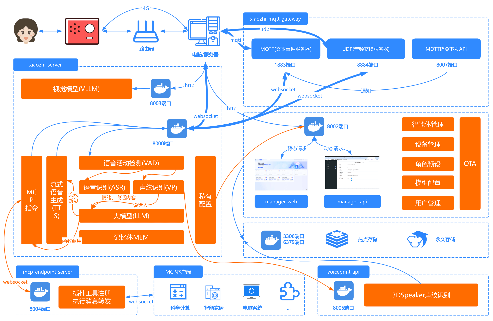
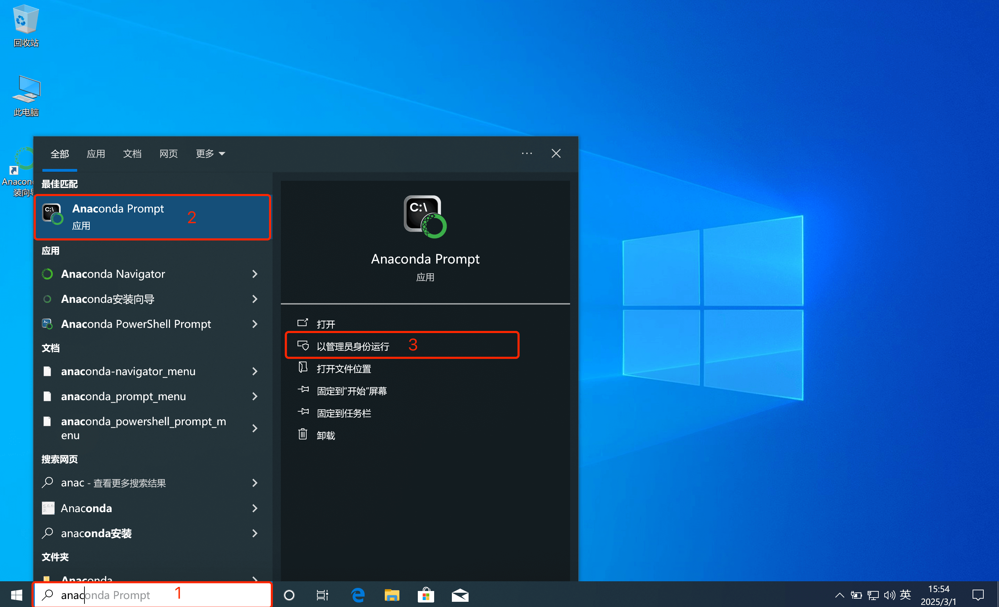
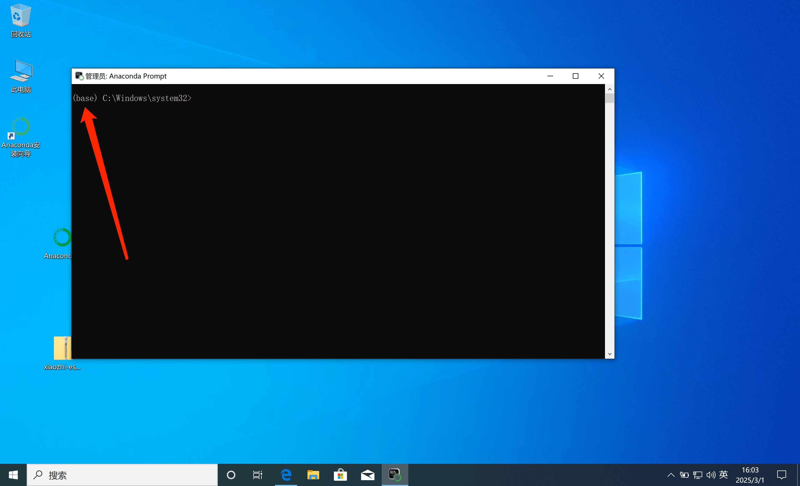

# Deployment Architecture Diagram

# Method 1: Docker runs all modules
Starting from `0.8.2` version, the Docker images released by this project only support `x86 architecture`. If you need to deploy on a CPU with `arm64 architecture`, you can follow [this tutorial](docker-build.md) to compile the `arm64 image` locally.

## 1. Install Docker

If you don’t have Docker installed on your computer, you can follow the instructions here: [Docker Installation](https://www.runoob.com/docker/ubuntu-docker-install.html)

There are two ways to install all modules in Docker. You can use the lazy script (./Deployment_all.md#11-Lazy Script) by @VanillaNahida.  
The script will automatically download the required files and configuration files for you. You can also use [manual deployment](./Deployment_all.md#12-Manual deployment) to build from scratch.


### 1.1 Lazy Script
The deployment is simple. You can refer to the [video tutorial](https://www.bilibili.com/video/BV17bbvzHExd/). The text version of the tutorial is as follows:
> [!NOTE]  
> Currently only supports one-click deployment on Ubuntu servers. Other systems have not been tried, and there may be some strange bugs.

Use SSH to connect to the server and execute the following script with root privileges
```bash
sudo bash -c "$(wget -qO- https://ghfast.top/https://raw.githubusercontent.com/xinnan-tech/xiaozhi-esp32-server/main/docker-setup.sh)"
```

The script automatically completes the following operations:
1. Install Docker
> 2. Configure the mirror source
> 3. Download/pull the image
> 4. Download the speech recognition model file
> 5. Boot and configure the server
>

After completing the simple configuration, refer to the three most important things mentioned in [4. Run the program](#4. Run the program) and [5. Restart the xiaozhi-esp32-server](#5. Restart the xiaozhi-esp32-server). After completing these three configurations, you can use it.

### 1.2 Manual Deployment

#### 1.2.1 Creating a Directory

After installation, you need to find a directory to store the configuration files for this project. For example, we can create a new folder called `xiaozhi-server`.

After creating the directory, you need to create a `data` folder and a `models` folder under `xiaozhi-server`, and a `SenseVoiceSmall` folder under `models`.

The final directory structure is as follows:

```
xiaozhi-server
  ├─ data
  ├─ models
     ├─ SenseVoiceSmall
```

#### 1.2.2 Download the speech recognition model file

The speech recognition model of this project uses the `SenseVoiceSmall` model by default for speech-to-text conversion. Because the model is large, it needs to be downloaded separately. After downloading, copy `model.pt`
The file is placed in `models/SenseVoiceSmall`
In the directory. Choose one of the following two download routes.

- Route 1: Download [SenseVoiceSmall](https://modelscope.cn/models/iic/SenseVoiceSmall/resolve/master/model.pt) from AliMoDa
- Route 2: Download [SenseVoiceSmall](https://pan.baidu.com/share/init?surl=QlgM58FHhYv1tFnUT_A8Sg&pwd=qvna) from Baidu Netdisk. Extraction code:
  `qvna`


#### 1.2.3 Download the configuration file

You need to download two configuration files: `docker-compose_all.yaml` and `config_from_api.yaml`. You need to download these two files from the project repository.

##### 1.2.3.1 Download docker-compose_all.yaml

Open [this link](../main/xiaozhi-server/docker-compose_all.yml) in your browser.

Find the button named `RAW` on the right side of the page. Next to the `RAW` button, find the download icon and click the download button to download the `docker-compose_all.yml` file. Download the file to your
In `xiaozhi-server`.

Or directly execute `wget https://raw.githubusercontent.com/xinnan-tech/xiaozhi-esp32-server/refs/heads/main/main/xiaozhi-server/docker-compose_all.yml` to download it.

After downloading, return to this tutorial and continue.

##### 1.2.3.2 Download config_from_api.yaml

Open [this link](../main/xiaozhi-server/config_from_api.yaml) with your browser.

Find the button named `RAW` on the right side of the page. Next to the `RAW` button, find the download icon and click the download button to download the `config_from_api.yaml` file. Download the file to your
In the `data` folder under `xiaozhi-server`, rename the `config_from_api.yaml` file to `.config.yaml`.

Or directly execute `wget https://raw.githubusercontent.com/xinnan-tech/xiaozhi-esp32-server/refs/heads/main/main/xiaozhi-server/config_from_api.yaml` to download and save.

After downloading the configuration file, we confirm that the files in the entire `xiaozhi-server` are as follows:

```
xiaozhi-server
  ├─ docker-compose_all.yml
  ├─ data
    ├─ .config.yaml
  ├─ models
     ├─ SenseVoiceSmall
       ├─ model.pt
```

If your file directory structure is the same as above, continue. If not, take a closer look to see if you missed anything.

## 2. Back up your data

If you have successfully run the smart console before and your key information is saved on it, please copy the important data from the smart console first, because the original data may be overwritten during the upgrade process.

## 3. Clear historical version images and containers
Next, open the command line tool and use the `terminal` or `command line` tool to enter your `xiaozhi-server` and execute the following command

```
docker compose -f docker-compose_all.yml down

docker stop xiaozhi-esp32-server
docker rm xiaozhi-esp32-server

docker stop xiaozhi-esp32-server-web
docker rm xiaozhi-esp32-server-web

docker stop xiaozhi-esp32-server-db
docker rm xiaozhi-esp32-server-db

docker stop xiaozhi-esp32-server-redis
docker rm xiaozhi-esp32-server-redis

docker rmi ghcr.nju.edu.cn/xinnan-tech/xiaozhi-esp32-server:server_latest
docker rmi ghcr.nju.edu.cn/xinnan-tech/xiaozhi-esp32-server:web_latest
```

## 4. Run the program
Run the following command to start the new version container:

```
docker compose -f docker-compose_all.yml up -d
```

After the execution is complete, execute the following command to view the log information.

```
docker logs -f xiaozhi-esp32-server-web
```

When you see the output log, it means your Smart Console has started successfully.

```
2025-xx-xx 22:11:12.445 [main] INFO cadsbaDruidDataSourceAutoConfigure - Init DruidDataSource
2025-xx-xx 21:28:53.873 [main] INFO xiaozhi.AdminApplication - Started AdminApplication in 16.057 seconds (process running for 17.941)
http://localhost:8002/xiaozhi/doc.html
```

Please note that only the `Smart Console` can run at this moment. If the `xiaozhi-esp32-server` on port 8000 reports an error, ignore it for now.

At this point, you need to use a browser to open the Smart Console, link to: http://127.0.0.1:8002, and register your first user. This first user is the Super Administrator, and subsequent users are regular users. Regular users can only bind devices and configure agents; Super Administrators can perform model management, user management, parameter configuration, and other functions.

There are three important things to do next:

### First important thing

Use the super administrator account to log in to the intelligent console, find `Parameter Management` in the top menu, find the first data in the list, the parameter code is `server.secret`, and copy it to `Parameter Value`.

`server.secret` needs to be explained. This `parameter value` is very important. It is used to connect our `Server` to `manager-api`. `server.secret` is a randomly generated key each time the manager module is deployed from scratch.

After copying the parameter value, open the .config.yaml file in the data directory under xiaozhi-server. Your configuration file should look like this:

```
manager-api:
  url: http://127.0.0.1:8002/xiaozhi
  secret: your server.secret value
```
1. Copy the parameter value of `server.secret` you just copied from the `Smart Console` to the `secret` in the `.config.yaml` file.

2. Because you are deploying in docker, change `url` to the following `http://xiaozhi-esp32-server-web:8002/xiaozhi`

3. Because you are deploying in docker, change `url` to the following `http://xiaozhi-esp32-server-web:8002/xiaozhi`

4. Because you are deploying with docker, change `url` to the following `http://xiaozhi-esp32-server-web:8002/xiaozhi`

Similar effects
```
manager-api:
  url: http://xiaozhi-esp32-server-web:8002/xiaozhi
  secret: 12345678-xxxx-xxxx-xxxx-123456789000
```

After saving, continue to do the second important thing

### The second important thing

Use the super administrator account to log in to the smart console, find "Model Configuration" in the top menu, then click "Large Language Model" in the left column, find the first data "Zhipu AI", and click the "Modify" button.
When the modification box pops up, fill in the key you registered with Zhipu AI into the API key field. Then click Save.

## 5. Restart xiaozhi-esp32-server

Next, open the command line tool and use the `terminal` or `command line` tool to enter
```
docker restart xiaozhi-esp32-server
docker logs -f xiaozhi-esp32-server
```
If you can see logs similar to the following, it means the server has been successfully started.

```
25-02-23 12:01:09[core.websocket_server] - INFO - Websocket address is ws://xxx.xx.xx.xx:8000/xiaozhi/v1/
25-02-23 12:01:09[core.websocket_server] - INFO - =======The above address is the websocket protocol address, please do not access it with a browser=======
25-02-23 12:01:09[core.websocket_server] - INFO - If you want to test websocket, please use Google Chrome to open the test_page.html in the test directory.
25-02-23 12:01:09[core.websocket_server] - INFO - =======================================================
```

Since you are deploying a full module, you have two important interfaces that need to be written to esp32.

OTA interface:
```
http://your host LAN ip:8002/xiaozhi/ota/
```

Websocket interface:
```
ws://your host machine's ip:8000/xiaozhi/v1/
```

### The third important thing

Use the super administrator account to log in to the intelligent console, find `Parameter Management` in the top menu, find the parameter code `server.websocket`, and enter your `Websocket interface`.

Use the super administrator account to log in to the smart console, find `Parameter Management` in the top menu, find the code `server.ota`, and enter your `OTA interface`.

Next, you can start operating your ESP32 device. You can either compile the ESP32 firmware yourself or use the firmware compiled by Xiage (version 1.6.1 or above).

1. [Compile your own ESP32 firmware](firmware-build.md).

2. [Configure a custom server based on the firmware compiled by Xia Ge](firmware-setting.md).


# Method 2: Run the entire module locally

## 1. Install MySQL database

If MySQL is already installed on your computer, you can directly create a database named `xiaozhi_esp32_server` in the database.

```sql
CREATE DATABASE xiaozhi_esp32_server CHARACTER SET utf8mb4 COLLATE utf8mb4_unicode_ci;
```

If you don't have MySQL yet, you can install MySQL through Docker

```
docker run --name xiaozhi-esp32-server-db -e MYSQL_ROOT_PASSWORD=123456 -p 3306:3306 -e MYSQL_DATABASE=xiaozhi_esp32_server -e MYSQL_INITDB_ARGS="--character-set-server=utf8mb4 --collation-server=utf8mb4_unicode_ci" -e TZ=Asia/Shanghai -d mysql:latest
```

## 2. Install redis

If you don't have Redis yet, you can install it via docker

```
docker run --name xiaozhi-esp32-server-redis -d -p 6379:6379 redis
```

## 3. Run the manager-api program

3.1 Install JDK 21 and set JDK environment variables

3.2 Install Maven and set Maven environment variables

3.3 Use Vscode programming tools and install Java environment related plug-ins

3.4 Use Vscode programming tool to load manager-api module

Configure database connection information in `src/main/resources/application-dev.yml`

```
spring:
  datasource:
    username: root
    password: 123456
```
Configure Redis connection information in `src/main/resources/application-dev.yml`
```
spring:
    data:
      redis:
        host: localhost
        port: 6379
        password:
        database: 0
```

3.5 Run the main program

This project is a SpringBoot project, and the startup method is:
Open `Application.java` and run the `Main` method to start

```
Path address:
src/main/java/xiaozhi/AdminApplication.java
```

When you see the output log, it means your `manager-api` is started successfully.

```
2025-xx-xx 22:11:12.445 [main] INFO cadsbaDruidDataSourceAutoConfigure - Init DruidDataSource
2025-xx-xx 21:28:53.873 [main] INFO xiaozhi.AdminApplication - Started AdminApplication in 16.057 seconds (process running for 17.941)
http://localhost:8002/xiaozhi/doc.html
```

## 4. Run the manager-web program

4.1 Install NodeJS

4.2 Use Vscode programming tool to load manager-web module

Enter the manager-web directory using the terminal command

```
npm install
```
Then start
```
npm run serve
```

Please note that if your manager-api interface is not at `http://localhost:8002`, please modify it during development.
Paths in `main/manager-web/.env.development`

After successfully running, you need to use a browser to open the Smart Console at http://127.0.0.1:8001 and register your first user. This first user is the Super Administrator, and subsequent users are regular users. Regular users can only bind devices and configure agents; Super Administrators can perform model management, user management, parameter configuration, and other functions.


Important: After successful registration, use the super administrator account to log in to the smart console, find "Model Configuration" in the top menu, then click "Large Language Model" in the left column, find the first data "Zhipu AI", and click the "Modify" button.
When the modification box pops up, fill in the key you registered with Zhipu AI into the API key field. Then click Save.

Important: After successful registration, use the super administrator account to log in to the smart console, find "Model Configuration" in the top menu, then click "Large Language Model" in the left column, find the first data "Zhipu AI", and click the "Modify" button.
When the modification box pops up, fill in the key you registered with Zhipu AI into the API key field. Then click Save.

Important: After successful registration, use the super administrator account to log in to the smart console, find "Model Configuration" in the top menu, then click "Large Language Model" in the left column, find the first data "Zhipu AI", and click the "Modify" button.
When the modification box pops up, fill in the key you registered with Zhipu AI into the API key field. Then click Save.

## 5. Install Python environment

This project uses `conda` to manage dependencies. If installing `conda` is inconvenient, you will need to install `libopus` and `ffmpeg` according to your operating system.
If you decide to use `conda`, after installing it, start executing the following commands.

Important tip! Windows users can manage their environment by installing Anaconda. After installing Anaconda, search for keywords related to Anaconda in Start.
Find `Anaconda Prpmpt` and run it as an administrator, as shown below.



After running, if you can see a (base) in front of the command line window, it means you have successfully entered the `conda` environment. Then you can execute the following commands.



```
conda remove -n xiaozhi-esp32-server --all -y
conda create -n xiaozhi-esp32-server python=3.10 -y
conda activate xiaozhi-esp32-server

# Add Tsinghua source channel
conda config --add channels https://mirrors.tuna.tsinghua.edu.cn/anaconda/pkgs/main
conda config --add channels https://mirrors.tuna.tsinghua.edu.cn/anaconda/pkgs/free
conda config --add channels https://mirrors.tuna.tsinghua.edu.cn/anaconda/cloud/conda-forge

conda install libopus -y
conda install ffmpeg -y
```

Please note that the above commands are not executed successfully all at once. You need to execute them step by step. After each step, check the output log to see if it is successful.

## 6. Install the dependencies of this project

You must first download the source code of this project. The source code can be downloaded using the `git clone` command if you are not familiar with the `git clone` command.

You can use your browser to open this address `https://github.com/xinnan-tech/xiaozhi-esp32-server.git`

After opening, find a green button on the page with the word `Code` written on it, click it, and then you will see the `Download ZIP` button.

Click it to download the source code compressed package of this project. After downloading it to your computer, unzip it. At this time, its name may be `xiaozhi-esp32-server-main`
You need to rename it to `xiaozhi-esp32-server`. In this file, go to the `main` folder, then go to `xiaozhi-server`. Please remember this directory `xiaozhi-server`.

```
# Continue using the conda environment
conda activate xiaozhi-esp32-server
# Enter your project root directory, then enter main/xiaozhi-server
cd main/xiaozhi-server
pip config set global.index-url https://mirrors.aliyun.com/pypi/simple/
pip install -r requirements.txt
```

### 7. Download the speech recognition model file

The speech recognition model of this project uses the `SenseVoiceSmall` model by default for speech-to-text conversion. Because the model is large, it needs to be downloaded separately. After downloading, copy `model.pt`
The file is placed in `models/SenseVoiceSmall`
In the directory. Choose one of the following two download routes.

- Route 1: Download [SenseVoiceSmall](https://modelscope.cn/models/iic/SenseVoiceSmall/resolve/master/model.pt) from AliMoDa
- Route 2: Download [SenseVoiceSmall](https://pan.baidu.com/share/init?surl=QlgM58FHhYv1tFnUT_A8Sg&pwd=qvna) from Baidu Netdisk. Extraction code:
  `qvna`

## 8. Configure project files

Use the super administrator account to log in to the intelligent console, find `Parameter Management` in the top menu, find the first data in the list, the parameter code is `server.secret`, and copy it to `Parameter Value`.

`server.secret` needs to be explained. This `parameter value` is very important. It is used to connect our `Server` to `manager-api`. `server.secret` is a randomly generated key each time the manager module is deployed from scratch.

If your `xiaozhi-server` directory does not have `data`, you need to create a `data` directory.
If there is no `.config.yaml` file under your `data` directory, you can copy the `config_from_api.yaml` file in the `xiaozhi-server` directory to `data` and rename it to `.config.yaml`

After copying the parameter value, open the .config.yaml file in the data directory under xiaozhi-server. Your configuration file should look like this:

```
manager-api:
  url: http://127.0.0.1:8002/xiaozhi
  secret: your server.secret value
```

Copy the parameter value of `server.secret` you just copied from the `Smart Console` to the `secret` in the `.config.yaml` file.

Similar effects
```
manager-api:
  url: http://127.0.0.1:8002/xiaozhi
  secret: 12345678-xxxx-xxxx-xxxx-123456789000
```

## 5. Run the project

```
# Make sure to execute in the xiaozhi-server directory
conda activate xiaozhi-esp32-server
python app.py
```

If you can see logs similar to the following, it means that the project service has been successfully started.

```
25-02-23 12:01:09[core.websocket_server] - INFO - Server is running at ws://xxx.xx.xx.xx:8000/xiaozhi/v1/
25-02-23 12:01:09[core.websocket_server] - INFO - =======The above address is the websocket protocol address, please do not access it with a browser=======
25-02-23 12:01:09[core.websocket_server] - INFO - If you want to test websocket, please use Google Chrome to open the test_page.html in the test directory.
25-02-23 12:01:09[core.websocket_server] - INFO - =======================================================
```

Since you are deploying a full module, you have two important interfaces.

OTA interface:
```
http://your computer LAN ip:8002/xiaozhi/ota/
```

Websocket interface:
```
ws://your computer LAN ip:8000/xiaozhi/v1/
```

Please be sure to write the above two interface addresses into the intelligent control console: they will affect the websocket address issuance and automatic upgrade functions.

1. Use the super administrator account to log in to the intelligent console, find "Parameter Management" in the top menu, find the parameter code "server.websocket", and enter your "Websocket interface".

2. Use the super administrator account to log in to the smart console, find "Parameter Management" in the top menu, find the code "server.ota", and enter your "OTA interface".


Next, you can start operating your ESP32 device. You can either compile the ESP32 firmware yourself or use the firmware compiled by Xiage (version 1.6.1 or above).

1. [Compile your own ESP32 firmware](firmware-build.md).

2. [Configure a custom server based on the firmware compiled by Xia Ge](firmware-setting.md).

# FAQ
Here are some frequently asked questions for your reference:

1. [Why does Xiaozhi recognize a lot of Korean, Japanese, and English when I say something?](./FAQ.md)
2. [Why does the error "TTS task error file does not exist" appear?](./FAQ.md)<br/>
3. [TTS often fails and times out](./FAQ.md)<br/>
4. [I can connect to my own server using Wi-Fi, but not using 4G](./FAQ.md)<br/>
5. [How to improve Xiaozhi's dialogue response speed? ](./FAQ.md)<br/>
6. [I speak very slowly, and Xiaozhi always interrupts me when I pause](./FAQ.md)
## Deployment related tutorials
1. [How to automatically pull the latest code of this project, compile and start it](./dev-ops-integration.md)<br/>
2. [How to integrate with Nginx](https://github.com/xinnan-tech/xiaozhi-esp32-server/issues/791)
## Expand related tutorials
1. [How to enable mobile phone number registration smart console](./ali-sms-integration.md)<br/>
2. [How to integrate HomeAssistant to achieve smart home control](./homeassistant-integration.md)
3. [How to enable the vision model to realize photo recognition](./mcp-vision-integration.md)
4. [How to deploy MCP access points](./mcp-endpoint-enable.md)
5. [How to access the MCP access point](./mcp-endpoint-integration.md)
6. [How to enable voiceprint recognition](./voiceprint-integration.md)
7. [News plugin source configuration guide](./newsnow_plugin_config.md)<br/>
8. [Weather Plugin Usage Guide](./weather-integration.md)
## Tutorials on voice cloning and local voice deployment
1. [How to deploy and integrate index-tts local voice](./index-stream-integration.md)<br/>
2. [How to deploy integrated fish-speech local voice](./fish-speech-integration.md)<br/>
3. [How to deploy and integrate PaddleSpeech local voice](./paddlespeech-deploy.md)<br/>
## Performance Testing Tutorial
1. [Component Speed ​​Test Guide](./performance_tester.md)<br/>
2. [Publish test results regularly](https://github.com/xinnan-tech/xiaozhi-performance-research)
