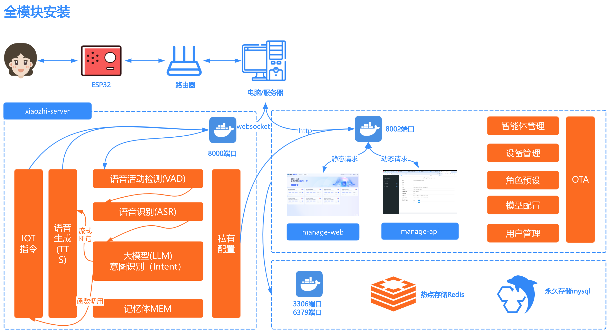

# デプロイアーキテクチャ図

# 方法1：Dockerで全モジュールを実行
Dockerイメージはx86アーキテクチャ、arm64アーキテクチャのCPUをサポートしており、国産OS上での実行もサポートしています。

## 1. Dockerのインストール

お使いのPCにDockerがまだインストールされていない場合は、こちらのチュートリアルに従ってインストールしてください：[Dockerのインストール](https://www.runoob.com/docker/ubuntu-docker-install.html)

#### 1.1 ディレクトリの作成

インストール後、このプロジェクトの設定ファイルを配置するディレクトリが必要です。例えば、`xiaozhi-server`という名前の新しいフォルダを作成します。

ディレクトリを作成したら、`xiaozhi-server`の下に`data`フォルダと`models`フォルダを作成し、`models`の下にさらに`SenseVoiceSmall`フォルダを作成する必要があります。

最終的なディレクトリ構造は次のようになります：

```
xiaozhi-server
  ├─ data
  ├─ models
     ├─ SenseVoiceSmall
```

#### 1.2 音声認識モデルファイルのダウンロード

このプロジェクトの音声認識モデルは、デフォルトで`SenseVoiceSmall`モデルを使用して音声からテキストへの変換を行います。モデルが大きいため、個別にダウンロードする必要があります。ダウンロード後、`model.pt`ファイルを`models/SenseVoiceSmall`ディレクトリに配置してください。以下の2つのダウンロードルートのいずれかを選択してください。

- ルート1：Alibaba ModelScopeからダウンロード[SenseVoiceSmall](https://modelscope.cn/models/iic/SenseVoiceSmall/resolve/master/model.pt)
- ルート2：Baidu Netdiskからダウンロード[SenseVoiceSmall](https://pan.baidu.com/share/init?surl=QlgM58FHhYv1tFnUT_A8Sg&pwd=qvna) 抽出コード: `qvna`


#### 1.3 設定ファイルのダウンロード

`docker-compose_all.yaml`と`config_from_api.yaml`の2つの設定ファイルをダウンロードする必要があります。これらのファイルはプロジェクトリポジトリからダウンロードする必要があります。

##### 1.3.1 docker-compose_all.yamlのダウンロード

ブラウザで[このリンク](../main/xiaozhi-server/docker-compose_all.yml)を開きます。

ページの右側にある`RAW`という名前のボタンを見つけ、その隣にあるダウンロードアイコンをクリックして`docker-compose_all.yml`ファイルをダウンロードします。ファイルを`xiaozhi-server`にダウンロードしてください。

または、`wget https://raw.githubusercontent.com/xinnan-tech/xiaozhi-esp32-server/refs/heads/main/main/xiaozhi-server/docker-compose_all.yml`を直接実行してダウンロードします。

ダウンロードが完了したら、このチュートリアルに戻って続行してください。

##### 1.3.2 config_from_api.yamlのダウンロード

ブラウザで[このリンク](../main/xiaozhi-server/config_from_api.yaml)を開きます。

ページの右側にある`RAW`という名前のボタンを見つけ、その隣にあるダウンロードアイコンをクリックして`config_from_api.yaml`ファイルをダウンロードします。ファイルを`xiaozhi-server`の下の`data`フォルダにダウンロードし、`config_from_api.yaml`ファイルの名前を`.config.yaml`に変更します。

または、`wget https://raw.githubusercontent.com/xinnan-tech/xiaozhi-esp32-server/refs/heads/main/main/xiaozhi-server/config_from_api.yaml`を直接実行してダウンロードして保存します。

設定ファイルをダウンロードした後、`xiaozhi-server`内のファイルが次のようになっていることを確認してください：

```
xiaozhi-server
  ├─ docker-compose_all.yml
  ├─ data
    ├─ .config.yaml
  ├─ models
     ├─ SenseVoiceSmall
       ├─ model.pt
```

ファイルディレクトリ構造が上記と同じであれば、次に進んでください。そうでなければ、何か操作を忘れていないかもう一度確認してください。

## 2. データのバックアップ

以前にインテリジェントコントロールパネルを正常に実行しており、そこにキー情報が保存されている場合は、まずインテリジェントコントロールパネルから重要なデータをコピーしてください。アップグレード中に元のデータが上書きされる可能性があるためです。

## 3. 過去のバージョンのイメージとコンテナの削除
次に、コマンドラインツールを開き、`ターミナル`または`コマンドプロンプト`ツールを使用して`xiaozhi-server`に移動し、次のコマンドを実行します。

```
docker compose -f docker-compose_all.yml down

docker stop xiaozhi-esp32-server
docker rm xiaozhi-esp32-server

docker stop xiaozhi-esp32-server-web
docker rm xiaozhi-esp32-server-web

docker stop xiaozhi-esp32-server-db
docker rm xiaozhi-esp32-server-db

docker stop xiaozhi-esp32-server-redis
docker rm xiaozhi-esp32-server-redis

docker rmi ghcr.nju.edu.cn/xinnan-tech/xiaozhi-esp32-server:server_latest
docker rmi ghcr.nju.edu.cn/xinnan-tech/xiaozhi-esp32-server:web_latest
```

## 4. プログラムの実行
次のコマンドを実行して、新しいバージョンのコンテナを起動します。

```
docker compose -f docker-compose_all.yml up -d
```

実行後、次のコマンドを実行してログ情報を表示します。

```
docker logs -f xiaozhi-esp32-server-web
```

出力ログが表示されたら、`インテリジェントコントロールパネル`が正常に起動したことを意味します。

```
2025-xx-xx 22:11:12.445 [main] INFO  c.a.d.s.b.a.DruidDataSourceAutoConfigure - Init DruidDataSource
2025-xx-xx 21:28:53.873 [main] INFO  xiaozhi.AdminApplication - Started AdminApplication in 16.057 seconds (process running for 17.941)
http://localhost:8002/xiaozhi/doc.html
```

この時点では`インテリジェントコントロールパネル`のみが実行可能であり、8000ポートの`xiaozhi-esp32-server`でエラーが発生しても、今は無視してください。

この時、ブラウザを使用して`インテリジェントコントロールパネル`を開く必要があります。リンク：http://127.0.0.1:8002 で、最初のユーザーを登録します。最初のユーザーがスーパー管理者となり、それ以降のユーザーは一般ユーザーとなります。一般ユーザーはデバイスのバインドとエージェントの設定のみが可能で、スーパー管理者はモデル管理、ユーザー管理、パラメータ設定などの機能を利用できます。

次に、3つの重要なことを行う必要があります：

### 最初の重要なこと

スーパー管理者アカウントでインテリジェントコントロールパネルにログインし、トップメニューから`パラメータ管理`を見つけ、リストの最初のデータであるパラメータコード`server.secret`を見つけ、その`パラメータ値`をコピーします。

`server.secret`について説明すると、この`パラメータ値`は非常に重要で、`Server`側が`manager-api`に接続するために使用されます。`server.secret`は、managerモジュールをゼロからデプロイするたびに自動的にランダム生成されるキーです。

`パラメータ値`をコピーした後、`xiaozhi-server`の下の`data`ディレクトリにある`.config.yaml`ファイルを開きます。この時点での設定ファイルの内容は次のようになっているはずです：

```
manager-api:
  url:  http://127.0.0.1:8002/xiaozhi
  secret: あなたのserver.secret値
```
1. 先ほど`インテリジェントコントロールパネル`からコピーした`server.secret`の`パラメータ値`を`.config.yaml`ファイルの`secret`にコピーします。

2. Dockerでデプロイしているため、`url`を`http://xiaozhi-esp32-server-web:8002/xiaozhi`に変更します。

3. Dockerでデプロイしているため、`url`を`http://xiaozhi-esp32-server-web:8002/xiaozhi`に変更します。

4. Dockerでデプロイしているため、`url`を`http://xiaozhi-esp32-server-web:8002/xiaozhi`に変更します。

次のような効果になります。
```
manager-api:
  url: http://xiaozhi-esp32-server-web:8002/xiaozhi
  secret: 12345678-xxxx-xxxx-xxxx-123456789000
```

保存したら、2番目の重要なことに進みます。

### 2番目の重要なこと

スーパー管理者アカウントでインテリジェントコントロールパネルにログインし、トップメニューから`モデル設定`を見つけ、左側のサイドバーで`大規模言語モデル`をクリックし、最初のデータ`Zhipu AI`を見つけ、`変更`ボタンをクリックします。
変更ダイアログが表示されたら、登録した`Zhipu AI`のキーを`APIキー`に入力し、保存をクリックします。

## 5. xiaozhi-esp32-serverの再起動

次に、コマンドラインツールを開き、`ターミナル`または`コマンドプロンプト`ツールで次のように入力します。
```
docker restart xiaozhi-esp32-server
docker logs -f xiaozhi-esp32-server
```
次のようなログが表示されれば、Serverが正常に起動したことを示します。

```
25-02-23 12:01:09[core.websocket_server] - INFO - Websocketアドレスは      ws://xxx.xx.xx.xx:8000/xiaozhi/v1/
25-02-23 12:01:09[core.websocket_server] - INFO - =======上記のアドレスはwebsocketプロトコルアドレスです。ブラウザでアクセスしないでください=======
25-02-23 12:01:09[core.websocket_server] - INFO - websocketをテストしたい場合は、Google Chromeでtestディレクトリのtest_page.htmlを開いてください
25-02-23 12:01:09[core.websocket_server] - INFO - =======================================================
```

全モジュールをデプロイしているため、esp32に書き込む必要がある2つの重要なインターフェースがあります。

OTAインターフェース：
```
http://あなたのPCのローカルネットワークIP:8002/xiaozhi/ota/
```

Websocketインターフェース：
```
ws://あなたのPCのローカルネットワークIP:8000/xiaozhi/v1/
```

### 3番目の重要なこと

スーパー管理者アカウントでインテリジェントコントロールパネルにログインし、トップメニューから`パラメータ管理`を見つけ、パラメータコード`server.websocket`を見つけ、あなたの`Websocketインターフェース`を入力します。

スーパー管理者アカウントでインテリジェントコントロールパネルにログインし、トップメニューから`パラメータ管理`を見つけ、パラメータコード`server.ota`を見つけ、あなたの`OTAインターフェース`を入力します。

これで、esp32デバイスの操作を開始できます。`esp32ファームウェアを自分でコンパイルする`か、`虾哥がコンパイルした1.6.1以上のバージョンのファームウェアを使用して設定する`ことができます。どちらかを選択してください。

1. [自分のesp32ファームウェアをコンパイルする](firmware-build.md)

2. [虾哥がコンパイルしたファームウェアに基づいてカスタムサーバーを設定する](firmware-setting.md)


# 方式二：本地源码运行全模块

## 1.安装MySQL数据库

如果本机已经安装了MySQL，可以直接在数据库中创建名为`xiaozhi_esp32_server`的数据库。

```sql
CREATE DATABASE xiaozhi_esp32_server CHARACTER SET utf8mb4 COLLATE utf8mb4_unicode_ci;
```

如果还没有MySQL，你可以通过docker安装mysql

```
docker run --name xiaozhi-esp32-server-db -e MYSQL_ROOT_PASSWORD=123456 -p 3306:3306 -e MYSQL_DATABASE=xiaozhi_esp32_server -e MYSQL_INITDB_ARGS="--character-set-server=utf8mb4 --collation-server=utf8mb4_unicode_ci" -e TZ=Asia/Shanghai -d mysql:latest
```

## 2.安装redis

如果还没有Redis，你可以通过docker安装redis

```
docker run --name xiaozhi-esp32-server-redis -d -p 6379:6379 redis
```

## 3.运行manager-api程序

3.1 安装JDK21，设置JDK环境变量

3.2 安装Maven，设置Maven环境变量

3.3 使用Vscode编程工具，安装好Java环境相关插件

3.4 使用Vscode编程工具加载manager-api模块

在`src/main/resources/application-dev.yml`中配置数据库连接信息

```
spring:
  datasource:
    username: root
    password: 123456
```
在`src/main/resources/application-dev.yml`中配置Redis连接信息
```
spring:
    data:
      redis:
        host: localhost
        port: 6379
        password:
        database: 0
```

3.5 运行主程序

本项目为SpringBoot项目，启动方式为：
打开`Application.java`运行`Main`方法启动

```
路径地址：
src/main/java/xiaozhi/AdminApplication.java
```

当你看到输出日志时，说明你的`manager-api`启动成功了。

```
2025-xx-xx 22:11:12.445 [main] INFO  c.a.d.s.b.a.DruidDataSourceAutoConfigure - Init DruidDataSource
2025-xx-xx 21:28:53.873 [main] INFO  xiaozhi.AdminApplication - Started AdminApplication in 16.057 seconds (process running for 17.941)
http://localhost:8002/xiaozhi/doc.html
```

## 4.运行manager-web程序

4.1 安装nodejs

4.2 使用Vscode编程工具加载manager-web模块

终端命令进入manager-web目录下

```
npm install
```
然后启动
```
npm run serve
```

请注意，如果你的manager-api的接口不在`http://localhost:8002`，请在开发时，修改
`main/manager-web/.env.development`中的路径

运行成功后，你需要使用浏览器，打开`智控台`，链接：http://127.0.0.1:8001 ，注册第一个用户。第一个用户即是超级管理员，以后的用户都是普通用户。普通用户只能绑定设备和配置智能体;超级管理员可以进行模型管理、用户管理、参数配置等功能。


重要：注册成功后，使用超级管理员账号，登录智控台，在顶部菜单找到`模型配置`，然后在左侧栏点击`大语言模型`，找到第一条数据`智谱AI`，点击`修改`按钮，
弹出修改框后，将你注册到的`智谱AI`的密钥填写到`API密钥`中。然后点击保存。

重要：注册成功后，使用超级管理员账号，登录智控台，在顶部菜单找到`模型配置`，然后在左侧栏点击`大语言模型`，找到第一条数据`智谱AI`，点击`修改`按钮，
弹出修改框后，将你注册到的`智谱AI`的密钥填写到`API密钥`中。然后点击保存。

重要：注册成功后，使用超级管理员账号，登录智控台，在顶部菜单找到`模型配置`，然后在左侧栏点击`大语言模型`，找到第一条数据`智谱AI`，点击`修改`按钮，
弹出修改框后，将你注册到的`智谱AI`的密钥填写到`API密钥`中。然后点击保存。

## 5.安装Python环境

本项目使用`conda`管理依赖环境。如果不方便安装`conda`，需要根据实际的操作系统安装好`libopus`和`ffmpeg`。
如果确定使用`conda`，则安装好后，开始执行以下命令。

重要提示！windows 用户，可以通过安装`Anaconda`来管理环境。安装好`Anaconda`后，在`开始`那里搜索`anaconda`相关的关键词，
找到`Anaconda Prpmpt`，使用管理员身份运行它。如下图。


运行之后，如果你能看到命令行窗口前面有一个(base)字样，说明你成功进入了`conda`环境。那么你就可以执行以下命令了。


```
conda remove -n xiaozhi-esp32-server --all -y
conda create -n xiaozhi-esp32-server python=3.10 -y
conda activate xiaozhi-esp32-server

# 添加清华源通道
conda config --add channels https://mirrors.tuna.tsinghua.edu.cn/anaconda/pkgs/main
conda config --add channels https://mirrors.tuna.tsinghua.edu.cn/anaconda/pkgs/free
conda config --add channels https://mirrors.tuna.tsinghua.edu.cn/anaconda/cloud/conda-forge

conda install libopus -y
conda install ffmpeg -y
```

请注意，以上命令，不是一股脑执行就成功的，你需要一步步执行，每一步执行完后，都检查一下输出的日志，查看是否成功。

## 6.安装本项目依赖

你先要下载本项目源码，源码可以通过`git clone`命令下载，如果你不熟悉`git clone`命令。

你可以用浏览器打开这个地址`https://github.com/xinnan-tech/xiaozhi-esp32-server.git`

打开完，找到页面中一个绿色的按钮，写着`Code`的按钮，点开它，然后你就看到`Download ZIP`的按钮。

点击它，下载本项目源码压缩包。下载到你电脑后，解压它，此时它的名字可能叫`xiaozhi-esp32-server-main`
你需要把它重命名成`xiaozhi-esp32-server`，在这个文件里，进入到`main`文件夹，再进入到`xiaozhi-server`，好了请记住这个目录`xiaozhi-server`。

```
# 继续使用conda环境
conda activate xiaozhi-esp32-server
# 进入到你的项目根目录，再进入main/xiaozhi-server
cd main/xiaozhi-server
pip config set global.index-url https://mirrors.aliyun.com/pypi/simple/
pip install -r requirements.txt
```

### 7.下载语音识别模型文件

本项目语音识别模型，默认使用`SenseVoiceSmall`模型，进行语音转文字。因为模型较大，需要独立下载，下载后把`model.pt`
文件放在`models/SenseVoiceSmall`
目录下。下面两个下载路线任选一个。

- 线路一：阿里魔塔下载[SenseVoiceSmall](https://modelscope.cn/models/iic/SenseVoiceSmall/resolve/master/model.pt)
- 线路二：百度网盘下载[SenseVoiceSmall](https://pan.baidu.com/share/init?surl=QlgM58FHhYv1tFnUT_A8Sg&pwd=qvna) 提取码:
  `qvna`

## 8.配置项目文件

使用超级管理员账号，登录智控台 ，在顶部菜单找到`参数管理`，找到列表中第一条数据，参数编码是`server.secret`，复制它到`参数值`。

`server.secret`需要说明一下，这个`参数值`很重要，作用是让我们的`Server`端连接`manager-api`。`server.secret`是每次从零部署manager模块时，会自动随机生成的密钥。

如果你的`xiaozhi-server`目录没有`data`，你需要创建`data`目录。
如果你的`data`下面没有`.config.yaml`文件，你可以把`xiaozhi-server`目录下的`config_from_api.yaml`文件复制到`data`，并重命名为`.config.yaml`

复制`参数值`后，打开`xiaozhi-server`下的`data`目录的`.config.yaml`文件。此刻你的配置文件内容应该是这样的：

```
manager-api:
  url: http://127.0.0.1:8002/xiaozhi
  secret: 你的server.secret值
```

把你刚才从`智控台`复制过来的`server.secret`的`参数值`复制到`.config.yaml`文件里的`secret`里。

类似这样的效果
```
manager-api:
  url: http://127.0.0.1:8002/xiaozhi
  secret: 12345678-xxxx-xxxx-xxxx-123456789000
```

## 5.运行项目

```
# 确保在xiaozhi-server目录下执行
conda activate xiaozhi-esp32-server
python app.py
```

如果你能看到，类似以下日志,则是本项目服务启动成功的标志。

```
25-02-23 12:01:09[core.websocket_server] - INFO - Server is running at ws://xxx.xx.xx.xx:8000/xiaozhi/v1/
25-02-23 12:01:09[core.websocket_server] - INFO - =======上面的地址是websocket协议地址，请勿用浏览器访问=======
25-02-23 12:01:09[core.websocket_server] - INFO - 如想测试websocket请用谷歌浏览器打开test目录下的test_page.html
25-02-23 12:01:09[core.websocket_server] - INFO - =======================================================
```

由于你是全模块部署，因此你有两个重要的接口。

OTA接口：
```
http://你电脑局域网的ip:8002/xiaozhi/ota/
```

Websocket接口：
```
ws://你电脑局域网的ip:8000/xiaozhi/v1/
```

请你务必把以上两个接口地址写入到智控台中：他们将会影响websocket地址发放和自动升级功能。

1、使用超级管理员账号，登录智控台，在顶部菜单找到`参数管理`，找到参数编码是`server.websocket`，输入你的`Websocket接口`。

2、使用超级管理员账号，登录智控台，在顶部菜单找到`参数管理`，找到数编码是`server.ota`，输入你的`OTA接口`。


接下来，你就可以开始操作你的esp32设备了，你可以`自行编译esp32固件`也可以配置使用`虾哥编译好的1.6.1以上版本的固件`。两个任选一个

1、 [编译自己的esp32固件](firmware-build.md)了。

2、 [基于虾哥编译好的固件配置自定义服务器](firmware-setting.md)了。

# 常见问题

以下是一些常见问题，供参考：

[1、为什么我说的话，小智识别出来很多韩文、日文、英文](./FAQ.md)

[2、为什么会出现“TTS 任务出错 文件不存在”？](./FAQ.md)

[3、TTS 经常失败，经常超时](./FAQ.md)

[4、使用Wifi能连接自建服务器，但是4G模式却接不上](./FAQ.md)

[5、如何提高小智对话响应速度？](./FAQ.md)

[6、我说话很慢，停顿时小智老是抢话](./FAQ.md)

[7、我想通过小智控制电灯、空调、远程开关机等操作](./FAQ.md)
