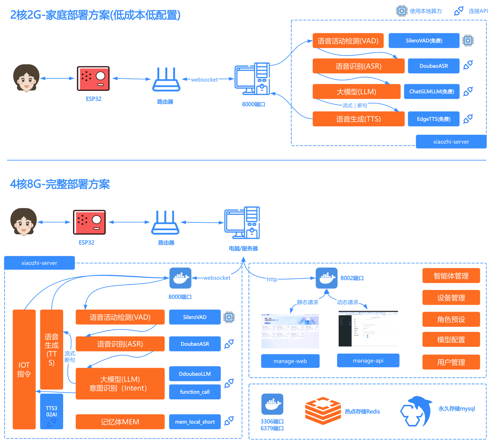

# Deployment Plan Reference  
  

## Method 1: Quick Deployment with Docker  

The Docker image supports x86 and ARM64 architectures and can run on domestic operating systems.  

### 1. Install Docker  

If Docker is not installed on your computer, follow this tutorial: [Docker Installation Guide](https://www.runoob.com/docker/ubuntu-docker-install.html).  

If Docker is already installed, you can:  
- Use the [1.1 Convenience Script](#11-convenience-script) to automatically download required files and configurations.  
- Deploy manually with Docker [1.2 Manual Deployment](#12-manual-deployment).  

#### 1.1 Convenience Script  

Run the following command to download and execute the deployment script:  
*(Ensure your environment can access GitHub, or the script won't download.)*  

```bash  
curl -L -o docker-setup.sh https://raw.githubusercontent.com/xinnan-tech/xiaozhi-esp32-server/main/docker-setup.sh  
```  

**For Windows users:**  
Run in **Git Bash, WSL, PowerShell, or CMD**:  
```bash  
# Git Bash or WSL  
sh docker-setup.sh  
# PowerShell or CMD  
.\docker-setup.sh  
```  

**For Linux/macOS users:**  
Run in the terminal:  
```bash  
chmod +x docker-setup.sh  
./docker-setup.sh  
```  

The script will automatically:  
> 1. Create necessary directory structures.  
> 2. Download the speech recognition model.  
> 3. Download configuration files.  
> 4. Verify file integrity.  
>  
> After completion, follow the prompts to configure the API key.  

Once done, proceed to [Configure Project Files](#3-configure-project-files).  

#### 1.2 Manual Deployment  

If the convenience script fails, follow this section for manual deployment.  

##### 1.2.1 Create Directories  

Choose a directory for the project (e.g., `xiaozhi-server`). Inside it, create:  
- `data` folder  
- `models` folder → Inside, create `SenseVoiceSmall`.  

Final directory structure:  
```
xiaozhi-server  
  ├─ data  
  ├─ models  
     ├─ SenseVoiceSmall  
```  

##### 1.2.2 Download Speech Recognition Model  

The default speech recognition uses an offline model. Download it here:  
[Jump to Model Download](#model-files)  

After downloading, return to this guide.  

##### 1.2.3 Download Configuration Files  

Download two files: `docker-compose.yaml` and `config.yaml` from the project repository.  

###### 1.2.3.1 Download `docker-compose.yaml`  
Open [this link](../main/xiaozhi-server/docker-compose.yml).  
Click the **RAW** button → Download → Save to `xiaozhi-server`.  

###### 1.2.3.2 Download `config.yaml`  
Open [this link](../main/xiaozhi-server/config.yaml).  
Click **RAW** → Download → Save to `xiaozhi-server/data` and rename to `.config.yaml`.  

Verify the final structure:  
```
xiaozhi-server  
  ├─ docker-compose.yml  
  ├─ data  
    ├─ .config.yaml  
  ├─ models  
     ├─ SenseVoiceSmall  
       ├─ model.pt  
```  
If correct, proceed.  

### 3. Configure Project Files  

Before running, configure the model settings:  
[Jump to Configuration Guide](#configuration-guide)  

After configuration, return here.  

### 4. Run Docker  

Open a terminal in `xiaozhi-server` and run:  
```bash  
docker-compose up -d  
```  
Check logs:  
```bash  
docker logs -f xiaozhi-esp32-server  
```  
Verify success: [Jump to Status Check](#status-check)  

### 5. Version Upgrade  

To upgrade later:  
1. Back up `.config.yaml` (copy key settings manually).  
2. Run:  
```bash  
docker stop xiaozhi-esp32-server  
docker rm xiaozhi-esp32-server  
docker rmi ghcr.nju.edu.cn/xinnan-tech/xiaozhi-esp32-server:server_latest  
```  
3. Redeploy using Docker.  

---  

## Method 2: Deployment Using Docker Environment  

For developers avoiding `conda`, use this method.  

### 1. Clone the Project  
### 2. [Download Model Files](#model-files)  
### 3. [Configure Project](#configuration-guide)  
### 4. Run Docker  

In `main/xiaozhi-server`, execute:  
```bash  
docker run -it --name xiaozhi-env --restart always --security-opt seccomp:unconfined \  
  -p 8000:8000 \  
  -p 8002:8002 \  
  -v ./:/app \  
  kalicyh/python:xiaozhi  
```  

### 5. Install Dependencies  
```bash  
pip install -r requirements.txt  
```  

### 6. Run the Project  
```bash  
python app.py  
```  

---  

## Method 3: Local Source Code Deployment  

### 1. Set Up Base Environment  

Uses `conda`. Windows users: Install **Anaconda** → Open **Anaconda Prompt (Admin)**.  
Run:  
```bash  
conda remove -n xiaozhi-esp32-server --all -y  
conda create -n xiaozhi-esp32-server python=3.10 -y  
conda activate xiaozhi-esp32-server  

# Add Tsinghua mirror  
conda config --add channels https://mirrors.tuna.tsinghua.edu.cn/anaconda/pkgs/main  
conda config --add channels https://mirrors.tuna.tsinghua.edu.cn/anaconda/pkgs/free  
conda config --add channels https://mirrors.tuna.tsinghua.edu.cn/anaconda/cloud/conda-forge  

conda install libopus -y  
conda install ffmpeg -y  
```  

### 2. Install Dependencies  

Download the project (ZIP or `git clone`). Navigate to `main/xiaozhi-server` and run:  
```bash  
conda activate xiaozhi-esp32-server  
pip config set global.index-url https://mirrors.aliyun.com/pypi/simple/  
pip install -r requirements.txt  
```  

### 3. [Download Model](#model-files)  
### 4. [Configure Project](#configuration-guide)  
### 5. Run  
```bash  
conda activate xiaozhi-esp32-server  
python app.py  
```  
Check logs for success: [Status Check](#status-check)  

---  

## Configuration Guide  

If `data/.config.yaml` doesn’t exist, copy `config.yaml` and rename it.  

Key settings:  
```yaml  
selected_module:  
  VAD: SileroVAD  
  ASR: FunASR  
  LLM: ChatGLMLLM  
  TTS: EdgeTTS  
  Memory: nomem    # Disabled by default  
  Intent: nointent # Disabled by default  
```  

To switch models (e.g., LLM options: `DeepSeekLLM`, `ChatGLMLLM`, `DifyLLM`), modify `selected_module`.  

---  

## Model Files  

Default speech model: **SenseVoiceSmall**. Download and place `model.pt` in `models/SenseVoiceSmall/`.  

Download options:  
- **Option 1:** [SenseVoiceSmall (ModelScope)](https://modelscope.cn/models/iic/SenseVoiceSmall/resolve/master/model.pt)  
- **Option 2:** [Baidu Netdisk](https://pan.baidu.com/share/init?surl=QlgM58FHhYv1tFnUT_A8Sg&pwd=qvna) (Code: `qvna`)  

---  

## Status Check  

Successful logs will show:  
```  
25-02-23 12:01:09[core.websocket_server] - INFO - Server is running at ws://xxx.xx.xx.xx:8000  
```  
For Docker deployments, replace `xxx.xx.xx.xx` with your local IP (e.g., `192.168.1.25`).  

Next: [Compile ESP32 Firmware](firmware-build.md).  

---  

### FAQs  
1. [Why does Xiaozhi transcribe my speech into Korean/Japanese/English?](../README.md#1)  
2. [Why "TTS Error: File Not Found"?](../README.md#2)  
3. [TTS frequently fails or times out](../README.md#3)  
4. [How to improve response speed?](../README.md#4)  
5. [Xiaozhi interrupts me mid-speech](../README.md#5)  
6. [Controlling lights/AC/power via Xiaozhi](../README.md#6)