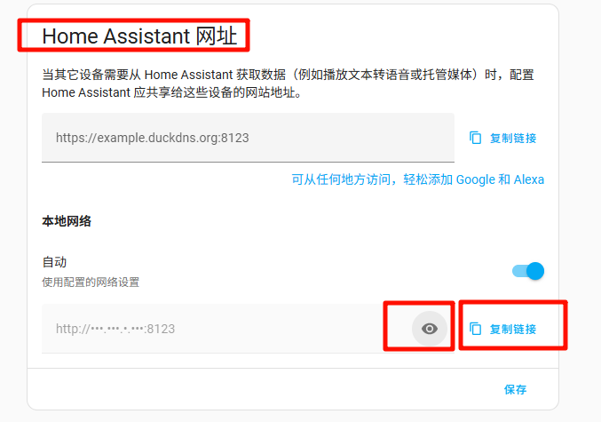
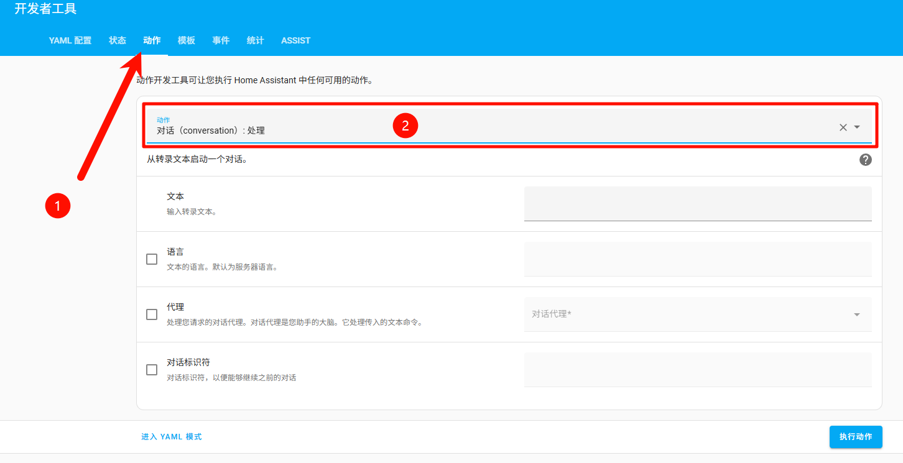
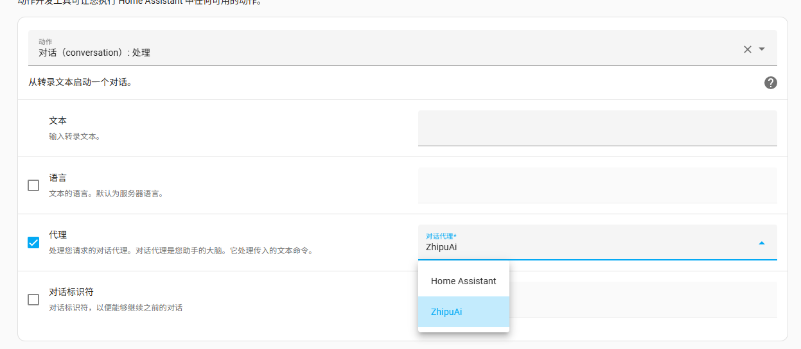
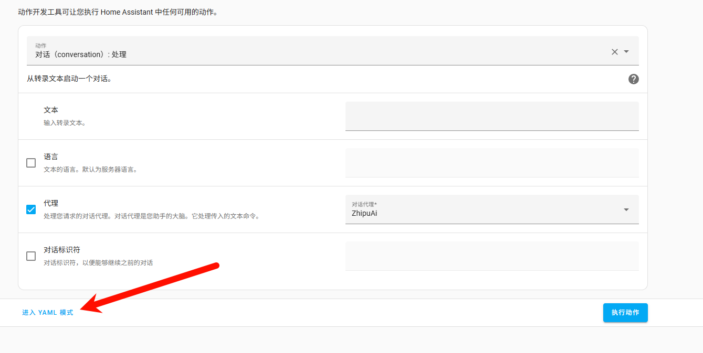
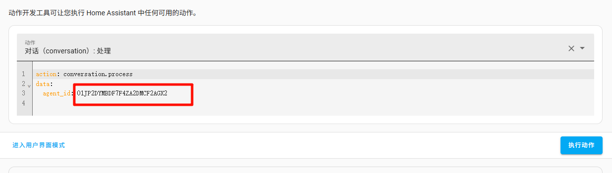

# Xiaozhi ESP32-Open Source Server and HomeAssistant Integration Guide

[TOC]

-----

## Introduction

This document will guide you on how to integrate your ESP32 device with HomeAssistant.

Prerequisites

- HomeAssistant installed and configured
- The model I chose this time is: free ChatGLM, which supports functioncall function call

## Pre-start operations (required)

### 1. Get HA's network address information

Please visit your Home Assistant network address, for example, my HA address is 192.168.4.7, the port is the default 8123, then open it in the browser

```
http://192.168.4.7:8123
```

> Manually query the IP address of HA** (only applicable when Xiaozhi esp32-server and HA are deployed on the same network device [such as the same wifi])**:
>
> 1. Enter Home Assistant (frontend).
>
2. Click **Settings** → **System** → **Network** in the lower left corner.
>
3. Scroll down to the Home Assistant website area at the bottom. Under Local network, click the eye button to see the current IP address (e.g., 192.168.1.10) and network interface. Click Copy link to copy the link.
>
> 

Alternatively, if you have set up a Home Assistant OAuth address that you can access directly, you can also access it directly in your browser.

```
http://homeassistant.local:8123
```

### 2. Log in to `Home Assistant` and get the development key

Log in to HomeAssistant, click your profile picture in the lower left corner -> Personal, switch to the Security navigation bar, scroll to the bottom of the page to find the Long-term access token to generate an api_key, and copy and save it. This api key will only appear once in all subsequent methods (tip: you can save the generated QR code image and scan it later to retrieve the api key).

## Method 1: HA call function built by Xiaozhi community

### Functional Description

- If you need to add new devices later, this method requires manually restarting the `xiaozhi-esp32-server` to update the device information** (Important**).

- You need to make sure you have integrated Xiaomi Home into HomeAssistant and imported your Xiaomi devices into HomeAssistant.

- You need to ensure that the `xiaozhi-esp32-server intelligent console` can be used normally.

- My `xiaozhi-esp32-server intelligent control console` and `HomeAssistant` are deployed on another port of the same machine, and the version is `0.3.10`

  ```
  http://192.168.4.7:8002
  ```


### Configuration steps

#### 1. Log in to `HomeAssistant` and organize the list of devices that need to be controlled

Log in to HomeAssistant, click Settings in the lower left corner, then go to Devices & Services, and then click Entities at the top.

Then search for the switch you want to control in the entity. When the results come out, click one of the results in the list, and a switch interface will appear.

On the switch interface, try clicking the switch to see if the development will turn on/off with our click. If it works, it means the network is working properly.

Then find the settings button in the switch panel and click it to view the `Entity Identifier` of this switch.

We open a notepad and organize a piece of data in this format:

Location + comma + device name + comma + `entity identifier` + semicolon

For example, I have a toy lamp in my company, and its identifier is switch.cuco_cn_460494544_cp1_on_p_2_1, so I write this data

```
Company,toy lamp,switch.cuco_cn_460494544_cp1_on_p_2_1;
```

Of course, I may have to operate two lights in the end, and my final result is:

```
Company,toy lamp,switch.cuco_cn_460494544_cp1_on_p_2_1;
company,desk lamp,switch.iot_cn_831898993_socn1_on_p_2_1;
```

This string, which we call "device list string", needs to be saved as it will be useful later.

#### 2. Log in to the Smart Control Panel


Log in to the Smart Console using an administrator account. In Agent Management, find your agent and click Configure Role.

Set intent recognition to `Function Call` or `LLM Intent Recognition`. You will see an `Edit Function` button on the right. Click the `Edit Function` button and the `Function Management` dialog box will pop up.

In the `Feature Management` box, you need to check `HomeAssistant device status query` and `HomeAssistant device status modification`.

After checking, click `HomeAssistant Device Status Query` in `Selected Functions`, and then configure your `HomeAssistant` address, key, and device list string in `Parameter Configuration`.

After editing, click `Save Configuration`, then the `Function Management` box will be hidden, and you can click Save Agent Configuration again.

After successful saving, you can wake up the device for operation.

#### 3. Wake up the device for control

Try saying to the ESP32, "Turn on XXX light"

## Method 2: Xiaozhi uses Home Assistant's voice assistant as an LLM tool

### Functional Description

This method has a significant drawback: it doesn't utilize the "function_call" plugin functionality within Xiaozhi's open-source ecosystem. Using Home Assistant as Xiaozhi's LLM tool transfers intent recognition capabilities to Home Assistant. However, this method allows you to experience native Home Assistant functionality without sacrificing Xiaozhi's chat capabilities. If this is a concern, you can use [Method 3](##Method 3: Using Home Assistant's MCP Service (Recommended)), which is also supported by Home Assistant and maximizes the functionality of Home Assistant.

### Configuration steps:

#### 1. Configure Home Assistant's large model voice assistant.

**You need to configure Home Assistant voice assistant or big model tool in advance.**

#### 2. Get the Agent ID of Home Assistant's voice assistant.

1. Enter Home Assistant. Click Developer Assistant on the left.
2. In the Developer Assistant, click the Actions tab (see step 1). In the Actions section, find or enter conversation.process and select Conversation: Process (see step 2).



3. Check the "Agent" option on the page. In the "Conversation Agent" box that lights up, select the voice assistant you configured in step 1. As shown in the picture, I configured "ZhipuAi" and selected it.



4. After selecting, click `Enter YAML mode` in the lower left corner of the form.



5. Copy the agent-id value. For example, mine is `01JP2DYMBDF7F4ZA2DMCF2AGX2` (for reference only).



6. Switch to the `config.yaml` file of the Xiaozhi open source server `xiaozhi-esp32-server`. In the LLM configuration, find Home Assistant and set your Home Assistant network address, API key, and the agent_id you just queried.
7. Change the `LLM` of the `selected_module` property in the `config.yaml` file to `HomeAssistant` and `Intent` to `nointent`.
8. Restart the Xiaozhi open source server `xiaozhi-esp32-server` and it will work normally.

## Method 3: Use Home Assistant's MCP service (recommended)

### Functional Description

- You need to integrate and install the HA integration [Model Context Protocol Server](https://www.home-assistant.io/integrations/mcp_server/) in Home Assistant in advance.

- This method and method 2 are both official solutions provided by HA. Unlike method 2, you can use the open source plug-in of Xiaozhi's open source server `xiaozhi-esp32-server` normally, and you can also use any LLM model that supports the function_call function.

### Configuration steps

#### 1. Install Home Assistant's MCP service integration.

Integration official website - [Model Context Protocol Server](https://www.home-assistant.io/integrations/mcp_server/).

Or follow the manual steps below.

Go to Settings > Devices & Services. on your Home Assistant page.
>
In the lower right corner, select the [Add Integration](https://my.home-assistant.io/redirect/config_flow_start?domain=mcp_server) button.
>
> - Select **Model Context Protocol Server** from the list.
>
> - Follow the on-screen instructions to complete the setup.

#### 2. Configure MCP configuration information for Xiaozhi Open Source Server


Go to the `data` directory and find the `.mcp_server_settings.json` file.

If there is no `.mcp_server_settings.json` file in your `data` directory,
- Please copy the `mcp_server_settings.json` file in the root directory of the `xiaozhi-server` folder to the `data` directory and rename it to `.mcp_server_settings.json`
- Or [download this file](https://github.com/xinnan-tech/xiaozhi-esp32-server/blob/main/main/xiaozhi-server/mcp_server_settings.json), download it to the `data` directory, and rename it to `.mcp_server_settings.json`


Modify the following content in `"mcpServers`:

```json
"Home Assistant": {
      "command": "mcp-proxy",
      "args": [
        "http://YOUR_HA_HOST/mcp_server/sse"
      ],
      "env": {
        "API_ACCESS_TOKEN": "YOUR_API_ACCESS_TOKEN"
      }
},
```

Notice:

1. **Replace configuration:**
   - Replace `YOUR_HA_HOST` in `args` with your HA service address. If your service address already contains https/http (for example, `http://192.168.1.101:8123`), just fill in `192.168.1.101:8123`.
   - Replace `YOUR_API_ACCESS_TOKEN` in `API_ACCESS_TOKEN` in `env` with the development key API key you obtained earlier.
2. **If you add a configuration within the brackets of `"mcpServers"` and there is no subsequent `mcpServers` configuration, you need to remove the final comma `,`**, otherwise parsing may fail.

**The final effect is as follows (reference as follows)**:

```json
 "mcpServers": {
    "Home Assistant": {
      "command": "mcp-proxy",
      "args": [
        "http://192.168.1.101:8123/mcp_server/sse"
      ],
      "env": {
        "API_ACCESS_TOKEN": "abcd.efghi.jkl"
      }
    }
  }
```

#### 3. Configure the system configuration of Xiaozhi open source server

1. **Choose any LLM model that supports function_call as Xiaozhi's LLM chat assistant (but do not choose Home Assistant as the LLM tool)**. This time I chose the free model: ChatGLM, which supports functioncall function calls, but the calls are sometimes unstable. If you want stability, I recommend setting the LLM to: DoubaoLLM, and the specific model_name used is: doubao-1-5-pro-32k-250115.

2. Switch to the `config.yaml` file of the Xiaozhi open source server `xiaozhi-esp32-server`, set your LLM large model configuration, and adjust the `Intent` of the `selected_module` configuration to `function_call`.

3. Restart the Xiaozhi open source server `xiaozhi-esp32-server` and it will work normally.
